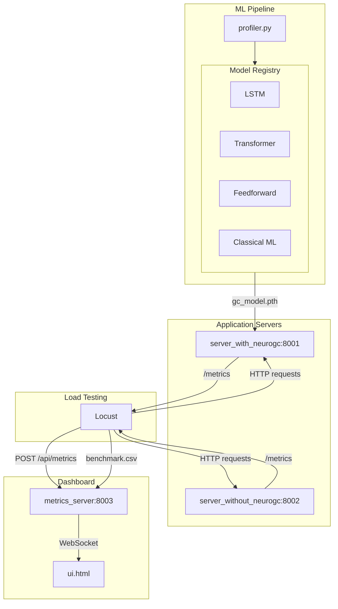

## NeuroGC

An intelligent garbage collection optimization system for Python applications using machine learning. NeuroGC learns application behavior patterns and triggers garbage collection proactively to minimize latency spikes and memory pressure.

### Table of Contents

- [Overview](#overview)
- [Architecture](#architecture)
- [Features](#features)
- [Installation](#installation)
- [Quick Start](#quick-start)
- [Usage](#usage)
  - [Phase 1: Collect Training Data](#phase-1-collect-training-data)
  - [Phase 2: Train the Model](#phase-2-train-the-model)
  - [Phase 3: Run Comparison Benchmark](#phase-3-run-comparison-benchmark)
- [Model Types](#model-types)
- [Replay Mode](#replay-mode)
- [Configuration](#configuration)
- [Project Structure](#project-structure)
- [Extending NeuroGC](#extending-neurogc)
- [Benchmarks](#benchmarks)
- [License](#license)

### Overview

Traditional Python garbage collection can cause unpredictable latency spikes during request processing. NeuroGC addresses this by:

1. Profiling application behavior (CPU, memory, disk I/O, network I/O)
2. Training an ML model to predict when GC would be beneficial
3. Triggering GC proactively during low-load periods

### Architecture



#### Components

| Component             | Description                                                          |
| --------------------- | -------------------------------------------------------------------- |
| `neurogc/`            | Core package with all functionality                                  |
| `neurogc/models/`     | ML model implementations (LSTM, Transformer, Feedforward, Classical) |
| `neurogc/server/`     | FastAPI server implementations                                       |
| `neurogc/dashboard/`  | Metrics aggregation and UI dashboard                                 |
| `neurogc/profiler.py` | System metrics collection                                            |
| `neurogc/config.py`   | Centralized configuration management                                 |
| `neurogc/utils.py`    | Shared utilities                                                     |

### Features

- Multiple ML model architectures (LSTM, Transformer, Feedforward, Classical ML)
- Pluggable model system - easily add custom models
- Real-time metrics visualization dashboard
- Side-by-side comparison of ML-driven vs default GC
- Benchmark data export and replay
- Configurable thresholds and parameters
- Catppuccin-themed UI with dark/light mode

### Installation

#### Prerequisites

- Python 3.14
- [uv](https://docs.astral.sh/uv/getting-started/installation/) (recommended) or pip

#### Setup

1. Clone the repository:

```bash
git clone https://github.com/Vishvam10/neurogc
cd neurogc
```

2. Create virtual environment:

```bash
uv venv --python 3.11
source .venv/bin/activate
```

3. Install dependencies:

```bash
uv sync
```

### Quick Start

```bash
# 1. Start the control server (default GC)
python server_without_neurogc.py

# 2. Start the metrics dashboard
python metrics_server.py

# 3. Run load test to collect training data
TARGET_SERVERS=without_gc locust -f locustfile.py --headless -u 10 -r 2 -t 2m

# 4. Train a model
python model.py --train profiler_data.csv

# 5. Start the NeuroGC server
python server_with_neurogc.py --model lstm

# 6. Run comparison benchmark
locust -f locustfile.py --headless -u 20 -r 5 -t 5m

# 7. View results at http://localhost:8003
```

### Usage

#### Phase 1: Collect Training Data

Run the server without NeuroGC to collect baseline performance data:

```bash
# Terminal 1: Start the baseline server
python server_without_neurogc.py

# Terminal 2: Start the metrics server
python metrics_server.py

# Terminal 3: Run load test
TARGET_SERVERS=without_gc locust -f locustfile.py --headless -u 10 -r 2 -t 2m
```

This generates `benchmark.csv` with profiling data.

#### Phase 2: Train the Model

Train any of the available models:

```bash
# Train LSTM model (default)
python model.py --train profiler_data.csv

# Or train directly from the neurogc package
python -m neurogc.models.lstm --train profiler_data.csv

# Train Transformer model
python -m neurogc.models.transformer --train profiler_data.csv

# Train Feedforward model
python -m neurogc.models.feedforward --train profiler_data.csv

# Train Classical ML model (Random Forest)
python -m neurogc.models.classical --train profiler_data.csv --algorithm random_forest
```

#### Phase 3: Run Comparison Benchmark

Run both servers simultaneously:

```bash
# Terminal 1: NeuroGC server (choose your model)
python server_with_neurogc.py --model lstm
# or
python server_with_neurogc.py --model transformer
# or
python server_with_neurogc.py --model feedforward
# or
python server_with_neurogc.py --model classical

# Terminal 2: Control server
python server_without_neurogc.py

# Terminal 3: Metrics dashboard
python metrics_server.py

# Terminal 4: Load test both
locust -f locustfile.py --headless -u 20 -r 5 -t 5m
```

View dashboard at http://localhost:8003

### Model Types

#### LSTM (Default)

Recurrent neural network that processes sequences of metrics to predict GC urgency.

```bash
python server_with_neurogc.py --model lstm
```

Best for: Capturing temporal patterns and trends in system metrics.

#### Transformer

Self-attention based model that can capture long-range dependencies.

```bash
python server_with_neurogc.py --model transformer
```

Best for: Complex patterns where distant metrics affect GC timing.

#### Feedforward

Simple MLP that uses flattened recent metrics.

```bash
python server_with_neurogc.py --model feedforward
```

Best for: Fast inference, simple deployments, baseline comparisons.

#### Classical ML

Traditional ML algorithms (Random Forest, Gradient Boosting, XGBoost).

```bash
python server_with_neurogc.py --model classical
```

Best for: Interpretability, when neural networks are overkill.

### Replay Mode

Replay saved benchmark data for analysis:

```bash
# Run benchmark (generates benchmark.csv on quit)
locust -f locustfile.py --headless -u 20 -r 5 -t 2m

# Replay the benchmark
python metrics_server.py --replay benchmark.csv
```

### Configuration

All parameters are in `config.json`:

```json
{
  "profile_interval": 1.0,
  "default_model": "lstm",
  "gc_threshold": 0.7,
  "server_ports": {
    "with_neurogc": 8001,
    "without_neurogc": 8002,
    "metrics_server": 8003
  },
  "models": {
    "lstm": {
      "hidden_size": 64,
      "num_layers": 2,
      "sequence_length": 10
    },
    "transformer": {
      "d_model": 64,
      "nhead": 4,
      "num_layers": 2
    },
    "feedforward": {
      "hidden_sizes": [64, 32],
      "lookback": 5
    },
    "classical": {
      "algorithm": "random_forest",
      "n_estimators": 100
    }
  }
}
```

#### Key Options

| Option             | Description                                      |
| ------------------ | ------------------------------------------------ |
| `profile_interval` | Metrics collection interval (seconds)            |
| `default_model`    | Model to use when not specified                  |
| `gc_threshold`     | Prediction threshold for triggering GC (0.0-1.0) |
| `models.*`         | Model-specific hyperparameters                   |

### Project Structure

```
neurogc/
├── neurogc/                    # Core package
│   ├── __init__.py
│   ├── config.py               # Configuration management
│   ├── utils.py                # Shared utilities
│   ├── profiler.py             # System metrics collection
│   ├── models/                 # ML models
│   │   ├── __init__.py         # Model registry
│   │   ├── base.py             # Abstract base class
│   │   ├── lstm.py             # LSTM implementation
│   │   ├── transformer.py      # Transformer implementation
│   │   ├── feedforward.py      # Feedforward implementation
│   │   └── classical.py        # Classical ML implementation
│   ├── server/                 # Server implementations
│   │   ├── __init__.py
│   │   ├── base.py             # Shared endpoints
│   │   ├── with_gc.py          # NeuroGC server
│   │   └── without_gc.py       # Control server
│   └── dashboard/              # Dashboard
│       ├── __init__.py
│       ├── server.py           # Metrics aggregation
│       └── ui.html             # Web UI
├── server_with_neurogc.py      # Entry point (thin wrapper)
├── server_without_neurogc.py   # Entry point (thin wrapper)
├── metrics_server.py           # Entry point (thin wrapper)
├── model.py                    # Entry point (backward compat)
├── profiler.py                 # Entry point (backward compat)
├── locustfile.py               # Load testing
├── config.json                 # Configuration
└── README.md
```

### Extending NeuroGC

#### Adding a Custom Model

1. Create a new file in `neurogc/models/`:

```python
# neurogc/models/my_model.py
from neurogc.models import register_model
from neurogc.models.base import BaseGCPredictor, ModelMetadata

@register_model("my_model")
class MyPredictor(BaseGCPredictor):
    @property
    def metadata(self) -> ModelMetadata:
        return ModelMetadata(
            name="my_model",
            version="1.0.0",
            description="My custom GC predictor"
        )

    def train(self, data_path, **kwargs):
        # Training logic
        pass

    def predict(self) -> float:
        # Return GC urgency 0.0-1.0
        pass

    # ... implement other required methods
```

2. Import in `neurogc/models/__init__.py`:

```python
from neurogc.models.my_model import MyPredictor
```

3. Use your model:

```bash
python server_with_neurogc.py --model my_model
```

### Benchmarks

Benchmark results are stored in the [`/benchmarks`](./benchmarks/) folder, organized by model type and date.

#### Directory Structure

```
benchmarks/
├── lstm/
│   ├── 30-01-2026-14-30/
│   │   ├── benchmark.csv
│   │   ├── README.md
│   │   ├── memory_usage.png
│   │   ├── latency_comparison.png
│   │   ├── gc_events.png
│   │   └── rps_timeline.png
│   └── 31-01-2026-10-15/
│       └── ...
├── transformer/
│   └── ...
└── feedforward/
    └── ...
```

Each benchmark folder contains:

- `benchmark.csv` - Raw metrics data
- `README.md` - Analysis summary with performance metrics, system info, and model metadata
- Visualization PNGs (memory usage, latency comparison, GC events, RPS timeline)

#### Running a Benchmark

```bash
# Set the model name for the benchmark
export NEUROGC_MODEL=lstm

# Run the load test (benchmark.csv is automatically saved to benchmarks/{model}/{timestamp}/)
locust -f locustfile.py --headless -u 20 -r 5 -t 5m
```

#### Analyzing a Benchmark

To analyze an existing benchmark CSV and generate visualizations:

```bash
# Auto-detect model from gc_model.pth or config.json
python analyze_benchmark.py benchmark.csv

# Specify model explicitly
python analyze_benchmark.py benchmark.csv --model lstm

# Specify custom output directory
python analyze_benchmark.py benchmark.csv --model transformer --output benchmarks/custom
```

The analysis script generates:

- Memory usage comparison chart
- P95/P99 latency comparison charts
- GC event timeline
- RPS over time chart
- README.md with performance summary table

### Linting and Formatting

```bash
# Check for issues
ruff check --config pyproject.toml

# Auto-fix
ruff check --fix --config pyproject.toml

# Format
ruff format --config pyproject.toml
```

### License

This project is licensed under the MIT License - see the [LICENSE](LICENSE) file for details.
