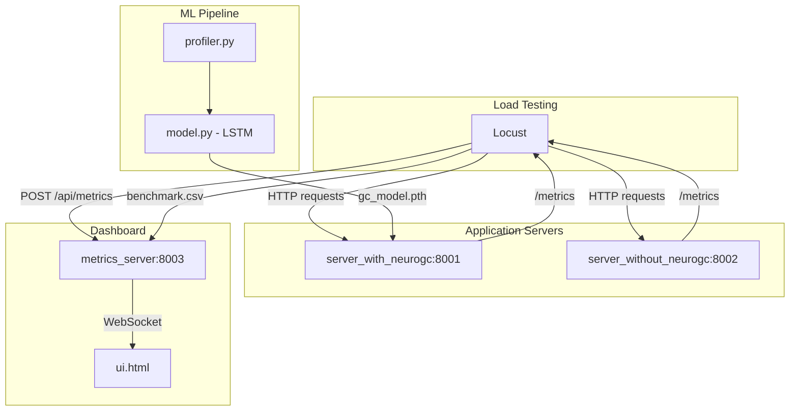

## NeuroGC

An intelligent garbage collection optimization system for Python applications using LSTM-based prediction models. NeuroGC learns application behavior patterns and triggers garbage collection proactively to minimize latency spikes and memory pressure.

### Table of Contents

- [Overview](#overview)
- [Architecture](#architecture)
- [Features](#features)
- [Installation](#installation)
- [Usage](#usage)
  - [Phase 1: Collect Training Data](#phase-1-collect-training-data)
  - [Phase 2: Train the Model](#phase-2-train-the-model)
  - [Phase 3: Run Comparison Benchmark](#phase-3-run-comparison-benchmark)
- [Replay Mode](#replay-mode)
- [Configuration](#configuration)
- [Benchmarks](#benchmarks)
- [License](#license)

### Overview

Traditional Python garbage collection can cause unpredictable latency spikes during request processing. NeuroGC addresses this by:

1. Profiling application behavior (CPU, memory, disk I/O, network I/O)
2. Training an LSTM model to predict when GC would be beneficial
3. Triggering GC proactively during low-load periods

### Architecture



#### Components

| Component | Description |
|-----------|-------------|
| `profiler.py` | Collects system metrics (CPU, memory, disk I/O, network I/O) |
| `model.py` | LSTM neural network for GC urgency prediction |
| `server_with_neurogc.py` | FastAPI server with ML-driven GC (port 8001) |
| `server_without_neurogc.py` | FastAPI server with default Python GC (port 8002) |
| `metrics_server.py` | Aggregates metrics and streams to dashboard (port 8003) |
| `locustfile.py` | Load testing configuration with metrics collection |
| `ui.html` | Real-time dashboard with Catppuccin theme |

### Features

- LSTM-based garbage collection prediction
- Real-time metrics visualization dashboard
- Side-by-side comparison of ML-driven vs default GC
- Benchmark data export and replay
- Configurable thresholds and parameters
- Catppuccin-themed UI with dark/light mode

### Installation

#### Prerequisites

- Python 3.14
- [uv](https://docs.astral.sh/uv/getting-started/installation/)

#### Setup

1. Clone the repository:

```bash
git clone https://github.com/Vishvam10/neurogc
cd neurogc
```

2. Create virtual environment:

```bash
uv venv --python 3.14
source .venv/bin/activate
```

3. Install dependencies:

```bash
uv sync
```

#### Linting and Formatting

```bash
# Check and auto fix issues
ruff check --config pyproject.toml
ruff check --fix --config pyproject.toml

# Format code
ruff check --select I --fix . --config pyproject.toml
ruff format --config pyproject.toml
```

### Usage

#### Phase 1: Collect Training Data

Run the server without NeuroGC to collect baseline performance data:

```bash
# Terminal 1 : Start the baseline server
python server_without_neurogc.py

# Terminal 2 : Start the metrics server (serves dashboard at http://localhost:8003)
python metrics_server.py

# Terminal 3 : Run load test to generate training data
TARGET_SERVERS=without_gc locust -f locustfile.py --headless -u 10 -r 2 -t 2m
```

This generates `benchmark.csv` with profiling data.

#### Phase 2 : Train the Model

Train the LSTM model using collected data:

```bash
python model.py --train profiler_data.csv
```

Output  : `gc_model.pth` (trained model weights)

Training parameters can be configured in `config.json` under `lstm_params`.

#### Phase 3 : Run Comparison Benchmark

Run both servers simultaneously to compare performance:

```bash
# Terminal 1 : Start server WITH NeuroGC
python server_with_neurogc.py

# Terminal 2 : Start server WITHOUT NeuroGC
python server_without_neurogc.py

# Terminal 3 : Start metrics server
python metrics_server.py

# Terminal 4 : Load test both servers
locust -f locustfile.py --headless -u 20 -r 5 -t 5m
```

View the dashboard at http://localhost:8003 to compare:
- CPU and Memory usage
- Network and Disk I/O
- Request latencies (p95, p99)
- GC trigger events

### Replay Mode

After running a benchmark, you can replay the recorded metrics:

```bash
# Run benchmark (generates benchmark.csv on quit)
locust -f locustfile.py --headless -u 20 -r 5 -t 2m

# Replay the benchmark data
python metrics_server.py --replay benchmark.csv
```

Open http://localhost:8003 to watch the replayed metrics visualization.

### Configuration

All parameters are configured in `config.json`:

```json
{
  "profile_interval": 1.0,
  "server_ports": {
    "with_neurogc": 8001,
    "without_neurogc": 8002,
    "metrics_server": 8003
  },
  "lstm_params": {
    "input_size": 10,
    "hidden_size": 64,
    "num_layers": 2,
    "sequence_length": 10,
    "epochs": 100,
    "learning_rate": 0.001,
    "batch_size": 32
  },
  "gc_threshold": 0.7,
  "thresholds": {
    "cpu": 80.0,
    "memory": 75.0,
    "disk_read": 100000000,
    "disk_write": 100000000,
    "net_sent": 10000000,
    "net_recv": 10000000,
    "p95": 500.0,
    "p99": 1000.0
  }
}
```

#### Configuration Options

| Option | Description |
|--------|-------------|
| `profile_interval` | Metrics collection interval in seconds |
| `server_ports` | Port assignments for each server |
| `lstm_params` | Neural network hyperparameters |
| `gc_threshold` | Prediction threshold for triggering GC (0.0-1.0) |
| `thresholds` | Alert thresholds for dashboard visualization |

### Benchmarks

<!-- Add benchmark results here -->

#### Memory Usage Comparison

<!--  -->

#### Latency Comparison

<!--  -->

#### GC Event Timeline

<!--  -->

#### Performance Summary

| Metric | Without NeuroGC | With NeuroGC | Improvement |
|--------|-----------------|--------------|-------------|
| Avg Memory | - | - | - |
| p95 Latency | - | - | - |
| p99 Latency | - | - | - |
| GC Pauses | - | - | - |

### License

This project is licensed under the MIT License - see the [LICENSE](LICENSE) file for details.
