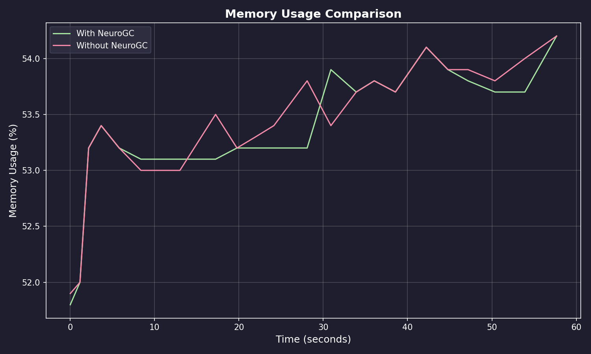
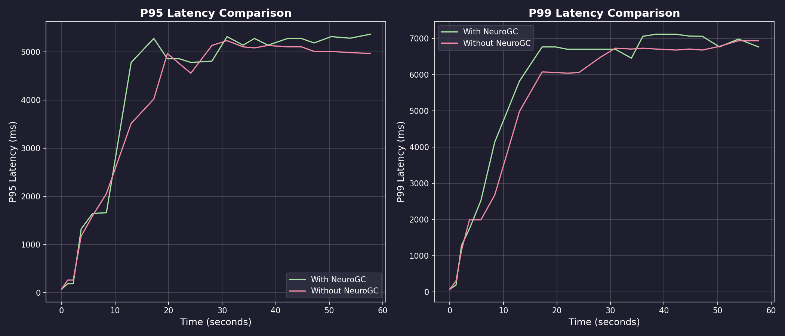
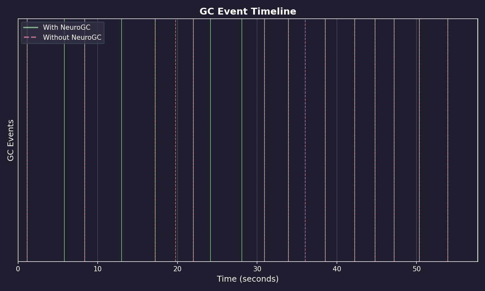
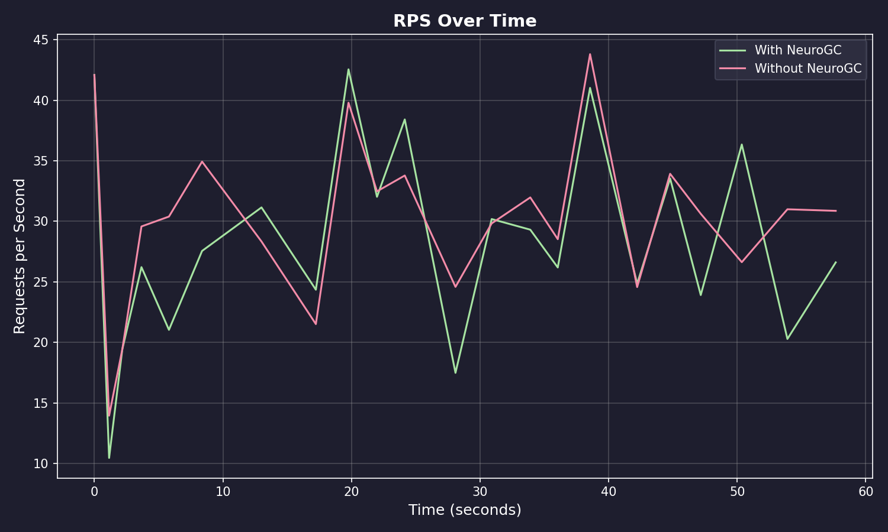

# Benchmark Results

**Date:** February 09, 2026 at 08:45

**Raw Data:** [benchmark.csv](./benchmark.csv)

- Training Load : `locust -f locustfile.py --headless -u 100 -r 10 --run-time 1m`
- Evaluation Load : `locust -f locustfile.py --headless -u 100 -r 10 --run-time 1m`

## Performance Summary

| Metric           | Without NeuroGC | With NeuroGC | Improvement |
| ---------------- | --------------- | ------------ | ----------- |
| Avg CPU (%)      | 44.9            | 42.4         | 🟢 +5.6%    |
| Avg Memory (%)   | 53.4            | 53.4         | 🟢 +0.1%    |
| Avg Disk Read    | 3612.88         | 14974.84     | 🔴 -314.5%  |
| Avg Disk Write   | 6651159.60      | 5976350.41   | 🟢 +10.1%   |
| Avg Net Sent     | 66004.88        | 83383.95     | 🔴 -26.3%   |
| Avg Net Recv     | 80518.80        | 102735.16    | 🔴 -27.6%   |
| P95 Latency (ms) | 3776.0          | 3953.4       | 🔴 -4.7%    |
| P99 Latency (ms) | 5064.2          | 5383.0       | 🔴 -6.3%    |
| Avg RPS          | 30.1            | 28.4         | 🔴 -5.7%    |
| GC Events        | 15              | 17           | 🟢 +13.3%   |

## Visualizations

### Memory Usage Comparison



### Latency Comparison



### GC Event Timeline



### RPS Over Time



## ML Model Metadata

```json
{
  "name": "classical",
  "algorithm": "random_forest",
  "n_estimators": 100,
  "max_depth": null,
  "lookback": 20
}
```

## System Information

| Property         | Value          |
| ---------------- | -------------- |
| Operating System | macOS 14.6     |
| Architecture     | arm64          |
| CPU              | arm            |
| CPU Cores        | 8 (logical: 8) |
| Memory           | 24.0 GB        |
| Disk             | 460.4 GB       |
| Python Version   | 3.14.0         |

## Benchmark Details

| Property                   | Value       |
| -------------------------- | ----------- |
| Total Samples (with GC)    | 22          |
| Total Samples (without GC) | 22          |
| Duration                   | ~22 seconds |
