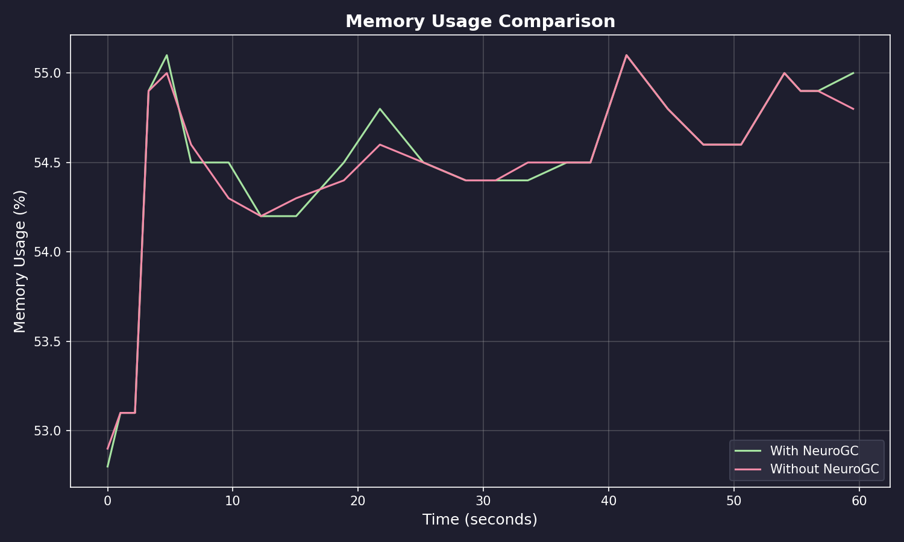
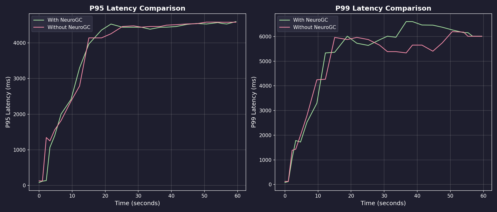
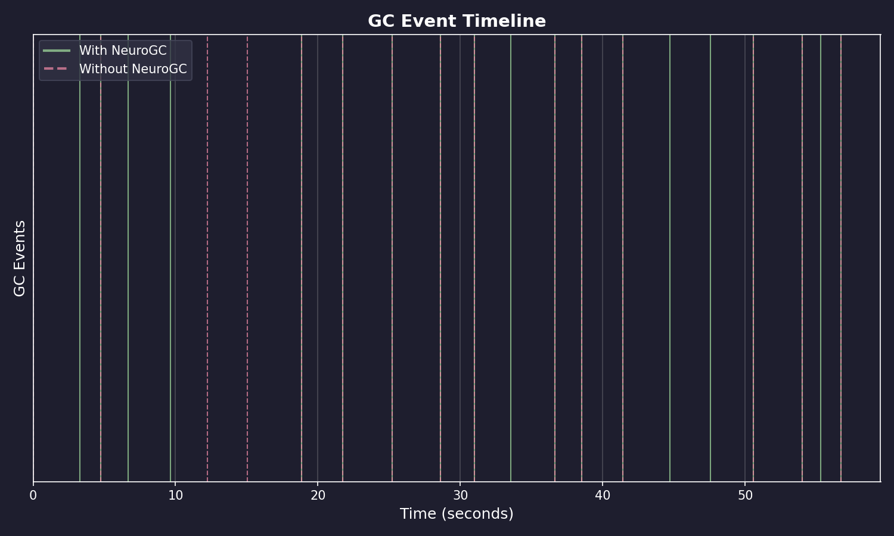

# Benchmark Results

**Date:** February 09, 2026 at 09:03

**Raw Data:** [benchmark.csv](./benchmark.csv)

- Training Load : `locust -f locustfile.py --headless ...`
- Evaluation Load : `locust -f locustfile.py --headless ...`

## Performance Summary

| Metric           | Without NeuroGC | With NeuroGC | Improvement |
| ---------------- | --------------- | ------------ | ----------- |
| Avg CPU (%)      | 39.0            | 39.3         | 🔴 -0.8%    |
| Avg Memory (%)   | 54.4            | 54.5         | 0.0%        |
| Avg Disk Read    | 2786.16         | 591.43       | 🟢 +78.8%   |
| Avg Disk Write   | 6037546.50      | 5408297.63   | 🟢 +10.4%   |
| Avg Net Sent     | 90606.60        | 67460.24     | 🟢 +25.5%   |
| Avg Net Recv     | 97007.71        | 74088.75     | 🟢 +23.6%   |
| P95 Latency (ms) | 3488.8          | 3450.9       | 🟢 +1.1%    |
| P99 Latency (ms) | 4587.6          | 4786.3       | 🔴 -4.3%    |
| Avg RPS          | 30.4            | 29.9         | 🔴 -1.6%    |
| GC Events        | 16              | 19           | 🟢 +18.8%   |

## Visualizations

### Memory Usage Comparison



### Latency Comparison



### GC Event Timeline



### RPS Over Time


## ML Model Metadata

```json
{
  "name": "classical",
  "algorithm": "random_forest",
  "n_estimators": 100,
  "max_depth": null,
  "lookback": 20
}
```

## System Information

| Property         | Value          |
| ---------------- | -------------- |
| Operating System | macOS 14.6     |
| Architecture     | arm64          |
| CPU              | arm            |
| CPU Cores        | 8 (logical: 8) |
| Memory           | 24.0 GB        |
| Disk             | 460.4 GB       |
| Python Version   | 3.14.0         |

## Benchmark Details

| Property                   | Value       |
| -------------------------- | ----------- |
| Total Samples (with GC)    | 25          |
| Total Samples (without GC) | 25          |
| Duration                   | ~25 seconds |
