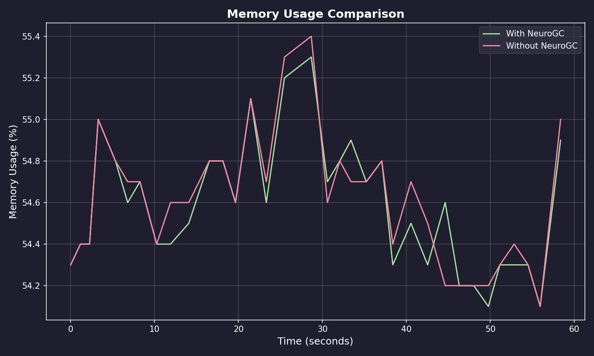
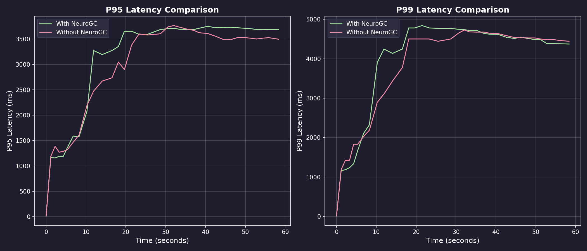
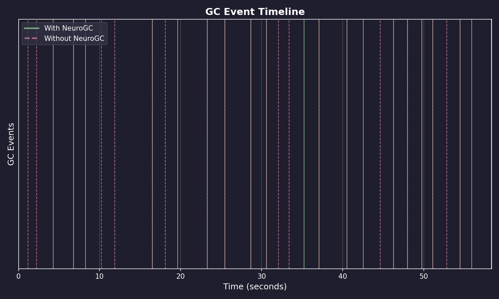

# Benchmark Results

**Date:** February 09, 2026 at 09:39

**Raw Data:** [benchmark.csv](./benchmark.csv)

- Training Load : `locust -f locustfile.py --headless ...`
- Evaluation Load : `locust -f locustfile.py --headless ...`

## Performance Summary

| Metric           | Without NeuroGC | With NeuroGC | Improvement |
| ---------------- | --------------- | ------------ | ----------- |
| Avg CPU (%)      | 35.3            | 33.7         | 🟢 +4.4%    |
| Avg Memory (%)   | 54.6            | 54.6         | 0.0%        |
| Avg Disk Read    | 75813.12        | 48446.51     | 🟢 +36.1%   |
| Avg Disk Write   | 8276695.12      | 5972533.47   | 🟢 +27.8%   |
| Avg Net Sent     | 119775.59       | 109045.08    | 🟢 +9.0%    |
| Avg Net Recv     | 130127.70       | 141767.53    | 🔴 -8.9%    |
| P95 Latency (ms) | 2879.6          | 3019.3       | 🔴 -4.9%    |
| P99 Latency (ms) | 3710.6          | 3820.0       | 🔴 -2.9%    |
| Avg RPS          | 42.9            | 40.1         | 🔴 -6.6%    |
| GC Events        | 23              | 20           | 🔴 -13.0%   |

## Visualizations

### Memory Usage Comparison



### Latency Comparison



### GC Event Timeline



### RPS Over Time


## ML Model Metadata

```json
{
  "name": "classical",
  "algorithm": "random_forest",
  "n_estimators": 100,
  "max_depth": null,
  "lookback": 20
}
```

## System Information

| Property         | Value          |
| ---------------- | -------------- |
| Operating System | macOS 14.6     |
| Architecture     | arm64          |
| CPU              | arm            |
| CPU Cores        | 8 (logical: 8) |
| Memory           | 24.0 GB        |
| Disk             | 460.4 GB       |
| Python Version   | 3.14.0         |

## Benchmark Details

| Property                   | Value       |
| -------------------------- | ----------- |
| Total Samples (with GC)    | 35          |
| Total Samples (without GC) | 35          |
| Duration                   | ~35 seconds |
