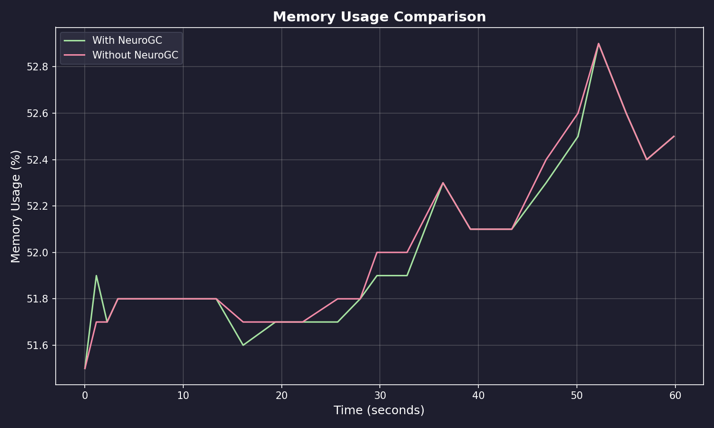
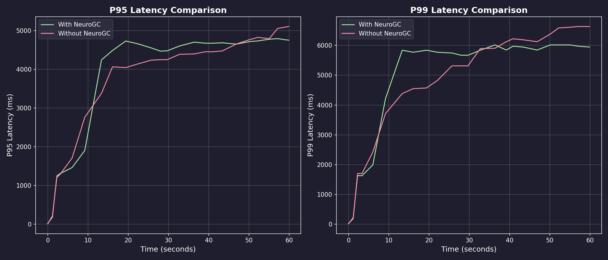
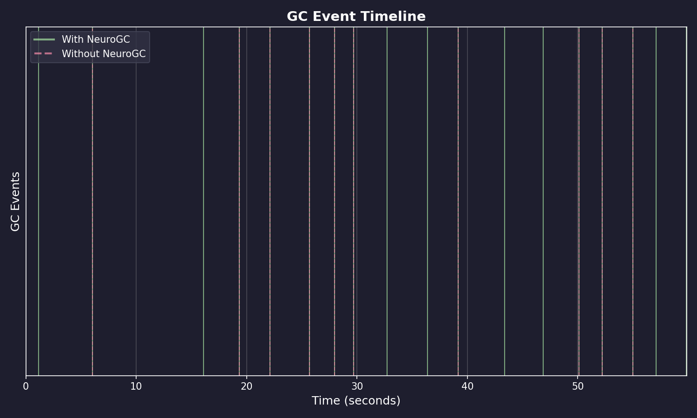
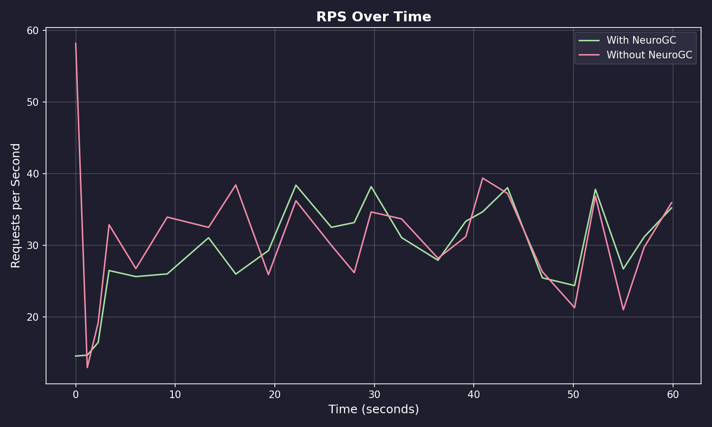

# Benchmark Results

**Date:** February 09, 2026 at 08:39

**Raw Data:** [benchmark.csv](./benchmark.csv)

- Training Load : `locust -f locustfile.py --headless -u 100 -r 10 --run-time 1m`
- Evaluation Load : `locust -f locustfile.py --headless -u 100 -r 10 --run-time 1m`

## Performance Summary

| Metric           | Without NeuroGC | With NeuroGC | Improvement |
| ---------------- | --------------- | ------------ | ----------- |
| Avg CPU (%)      | 39.1            | 35.8         | 🟢 +8.5%    |
| Avg Memory (%)   | 52.0            | 52.0         | 0.0%        |
| Avg Disk Read    | 111.08          | 538.84       | 🔴 -385.1%  |
| Avg Disk Write   | 4043632.86      | 5378153.27   | 🔴 -33.0%   |
| Avg Net Sent     | 79509.87        | 86359.99     | 🔴 -8.6%    |
| Avg Net Recv     | 84143.16        | 93475.29     | 🔴 -11.1%   |
| P95 Latency (ms) | 3623.6          | 3729.1       | 🔴 -2.9%    |
| P99 Latency (ms) | 4722.7          | 4810.8       | 🔴 -1.9%    |
| Avg RPS          | 31.2            | 29.1         | 🔴 -6.7%    |
| GC Events        | 10              | 18           | 🟢 +80.0%   |

## Visualizations

### Memory Usage Comparison



### Latency Comparison



### GC Event Timeline



### RPS Over Time



## ML Model Metadata

```json
{
  "name": "feedforward",
  "hidden_sizes": [64, 32, 16, 8],
  "lookback": 20,
  "epochs": 100,
  "learning_rate": 0.001,
  "batch_size": 32
}
```

## System Information

| Property         | Value          |
| ---------------- | -------------- |
| Operating System | macOS 14.6     |
| Architecture     | arm64          |
| CPU              | arm            |
| CPU Cores        | 8 (logical: 8) |
| Memory           | 24.0 GB        |
| Disk             | 460.4 GB       |
| Python Version   | 3.14.0         |

## Benchmark Details

| Property                   | Value       |
| -------------------------- | ----------- |
| Total Samples (with GC)    | 24          |
| Total Samples (without GC) | 24          |
| Duration                   | ~24 seconds |
