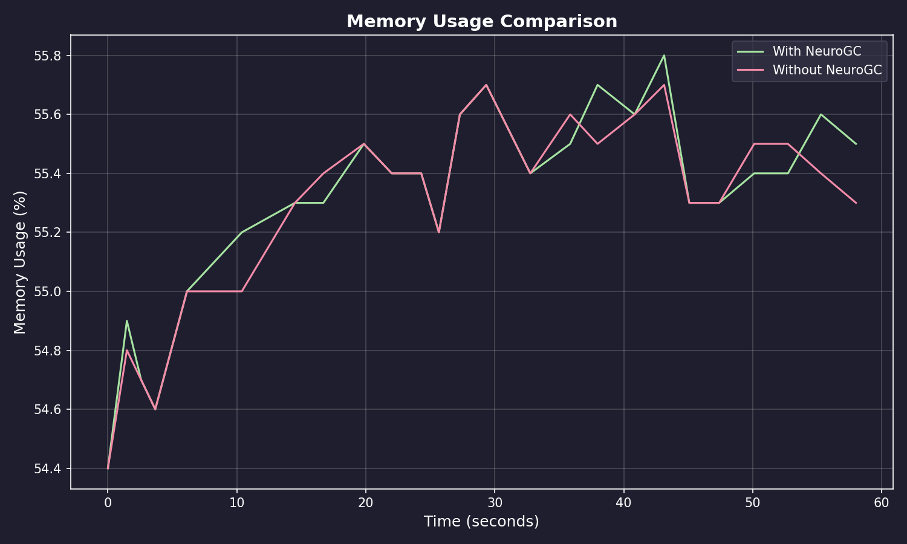
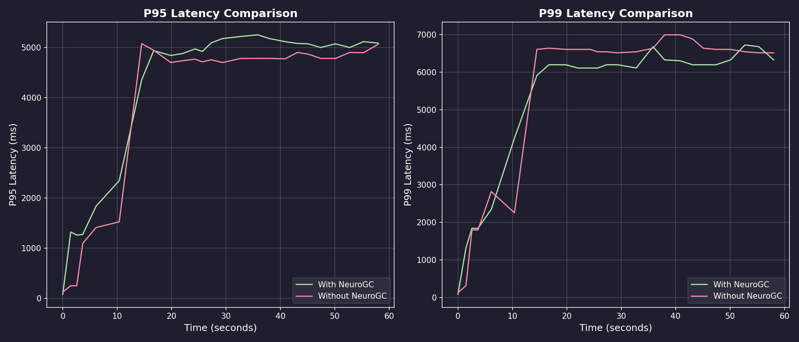
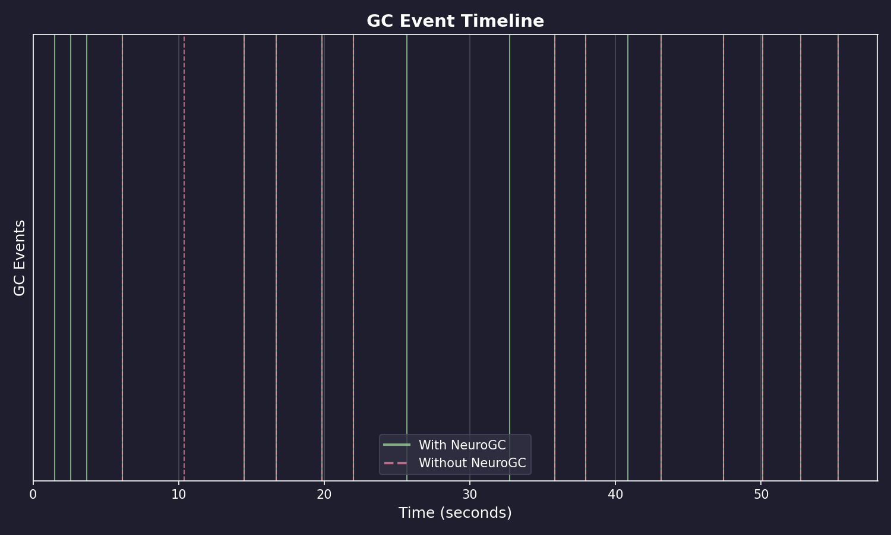
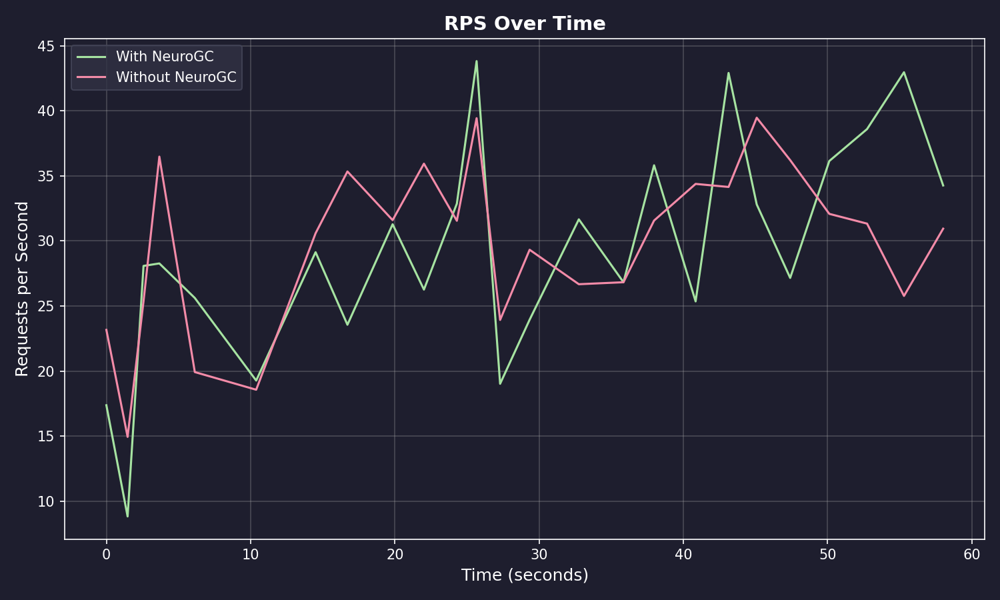

# Benchmark Results

**Date:** February 09, 2026 at 09:06

**Raw Data:** [benchmark.csv](./benchmark.csv)

- Training Load : `locust -f locustfile.py --headless ...`
- Evaluation Load : `locust -f locustfile.py --headless ...`

## Performance Summary

| Metric           | Without NeuroGC | With NeuroGC | Improvement |
| ---------------- | --------------- | ------------ | ----------- |
| Avg CPU (%)      | 39.8            | 43.0         | 🔴 -8.0%    |
| Avg Memory (%)   | 55.3            | 55.3         | 0.0%        |
| Avg Disk Read    | 7675.69         | 11055.08     | 🔴 -44.0%   |
| Avg Disk Write   | 5940870.38      | 8232453.21   | 🔴 -38.6%   |
| Avg Net Sent     | 93112.14        | 74657.59     | 🟢 +19.8%   |
| Avg Net Recv     | 95884.71        | 90835.58     | 🟢 +5.3%    |
| P95 Latency (ms) | 3855.2          | 4139.6       | 🔴 -7.4%    |
| P99 Latency (ms) | 5410.8          | 5231.7       | 🟢 +3.3%    |
| Avg RPS          | 29.8            | 29.3         | 🔴 -1.8%    |
| GC Events        | 14              | 18           | 🟢 +28.6%   |

## Visualizations

### Memory Usage Comparison



### Latency Comparison



### GC Event Timeline



### RPS Over Time



## ML Model Metadata

```json
{
  "name": "feedforward",
  "hidden_sizes": [64, 32, 16, 8],
  "lookback": 20,
  "epochs": 100,
  "learning_rate": 0.001,
  "batch_size": 32
}
```

## System Information

| Property         | Value          |
| ---------------- | -------------- |
| Operating System | macOS 14.6     |
| Architecture     | arm64          |
| CPU              | arm            |
| CPU Cores        | 8 (logical: 8) |
| Memory           | 24.0 GB        |
| Disk             | 460.4 GB       |
| Python Version   | 3.14.0         |

## Benchmark Details

| Property                   | Value       |
| -------------------------- | ----------- |
| Total Samples (with GC)    | 25          |
| Total Samples (without GC) | 25          |
| Duration                   | ~25 seconds |
