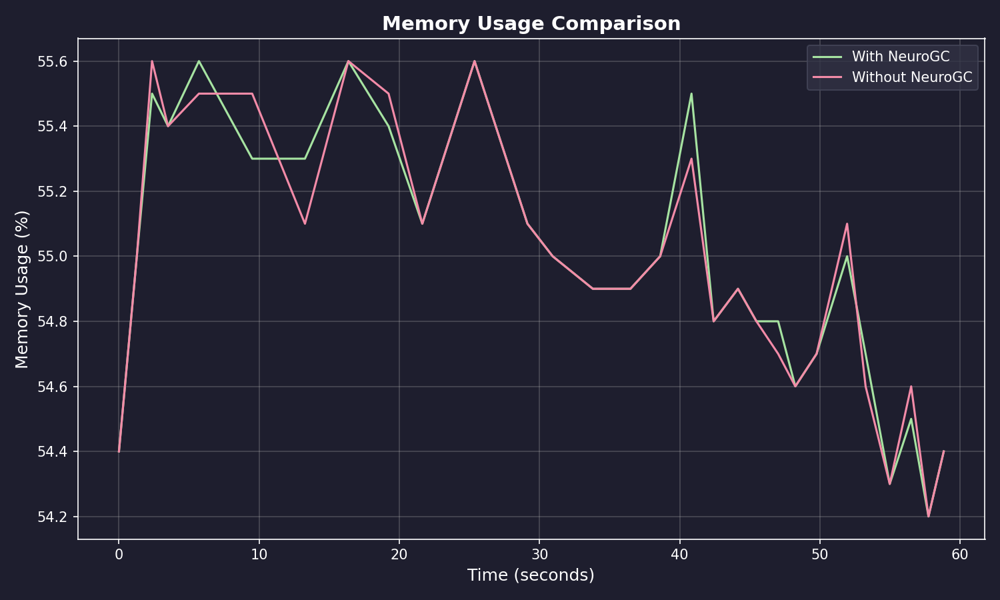
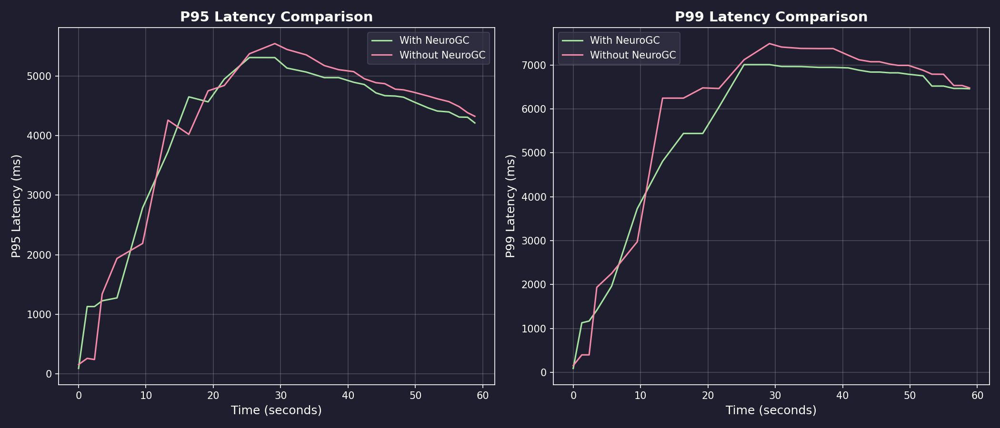
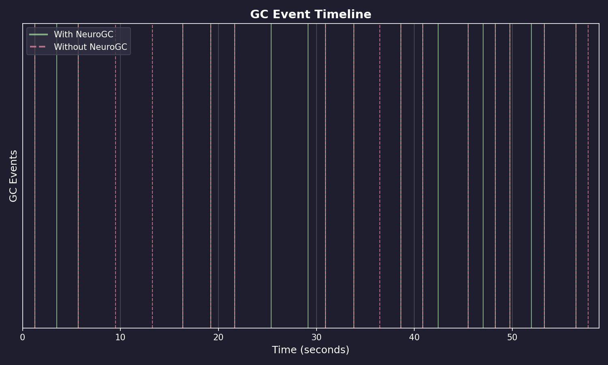
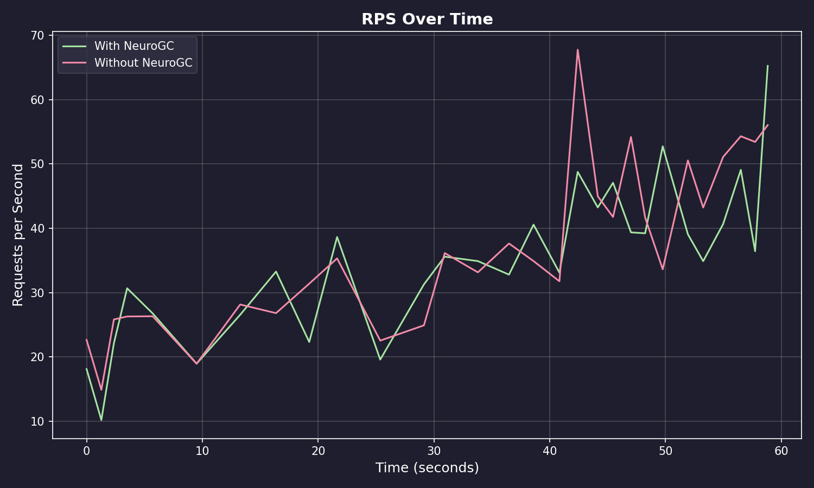

# Benchmark Results

**Date:** February 09, 2026 at 09:23

**Raw Data:** [benchmark.csv](./benchmark.csv)

- Training Load : `locust -f locustfile.py --headless -u 100 -r 10 --run-time 5m`
- Evaluation Load : `locust -f locustfile.py --headless -u 100 -r 10 --run-time 1m`

## Performance Summary

| Metric           | Without NeuroGC | With NeuroGC | Improvement |
| ---------------- | --------------- | ------------ | ----------- |
| Avg CPU (%)      | 36.2            | 45.6         | 🔴 -26.2%   |
| Avg Memory (%)   | 55.0            | 55.0         | 0.0%        |
| Avg Disk Read    | 1186.42         | 3065.07      | 🔴 -158.3%  |
| Avg Disk Write   | 6996910.50      | 5513574.88   | 🟢 +21.2%   |
| Avg Net Sent     | 101125.85       | 156501.60    | 🔴 -54.8%   |
| Avg Net Recv     | 120104.51       | 128264.26    | 🔴 -6.8%    |
| P95 Latency (ms) | 4038.0          | 3979.7       | 🟢 +1.4%    |
| P99 Latency (ms) | 5765.1          | 5523.3       | 🟢 +4.2%    |
| Avg RPS          | 36.9            | 34.9         | 🔴 -5.5%    |
| GC Events        | 18              | 20           | 🟢 +11.1%   |

## Visualizations

### Memory Usage Comparison



### Latency Comparison



### GC Event Timeline



### RPS Over Time



## ML Model Metadata

```json
{
  "name": "feedforward",
  "hidden_sizes": [64, 32, 16, 8],
  "lookback": 20,
  "epochs": 100,
  "learning_rate": 0.001,
  "batch_size": 32
}
```

## System Information

| Property         | Value          |
| ---------------- | -------------- |
| Operating System | macOS 14.6     |
| Architecture     | arm64          |
| CPU              | arm            |
| CPU Cores        | 8 (logical: 8) |
| Memory           | 24.0 GB        |
| Disk             | 460.4 GB       |
| Python Version   | 3.14.0         |

## Benchmark Details

| Property                   | Value       |
| -------------------------- | ----------- |
| Total Samples (with GC)    | 29          |
| Total Samples (without GC) | 29          |
| Duration                   | ~29 seconds |
