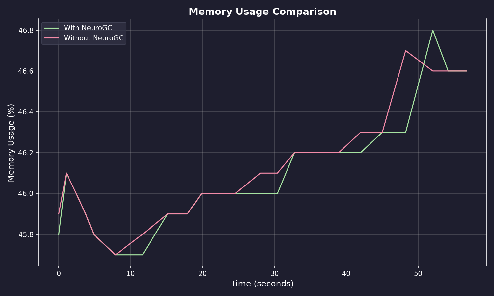
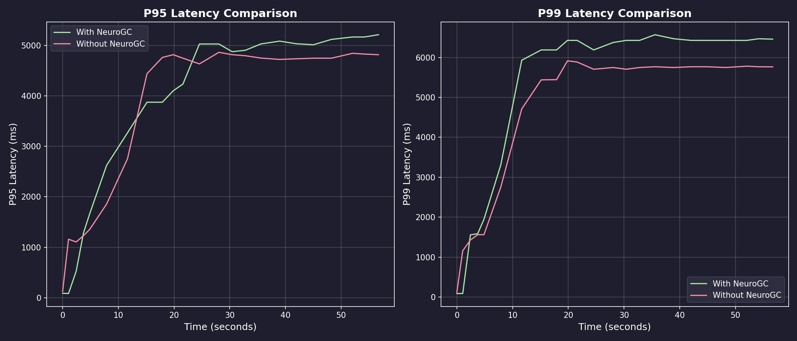
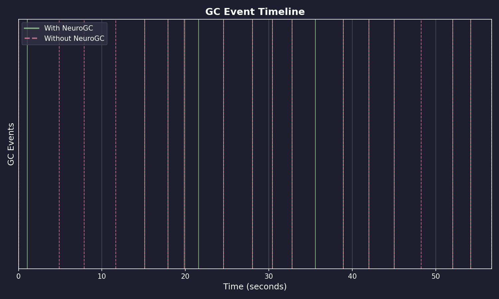
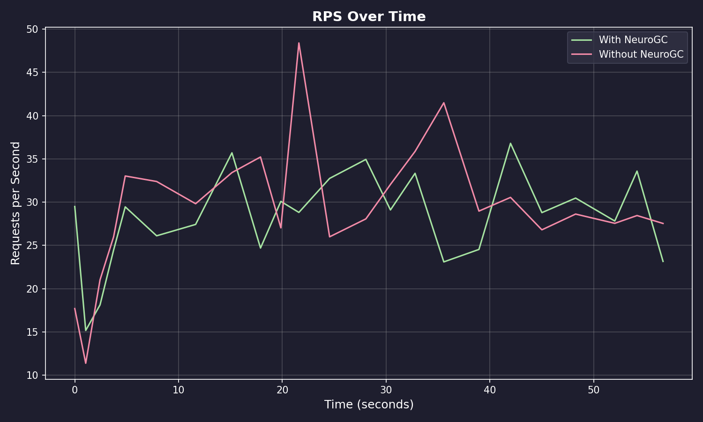

# Benchmark Results

**Date:** February 09, 2026 at 08:09

**Raw Data:** [benchmark.csv](./benchmark.csv)

- Training Load : `locust -f locustfile.py --headless -u 100 -r 10 --run-time 1m`
- Evaluation Load : `locust -f locustfile.py --headless -u 100 -r 10 --run-time 1m`

## Performance Summary

| Metric           | Without NeuroGC | With NeuroGC | Improvement |
| ---------------- | --------------- | ------------ | ----------- |
| Avg CPU (%)      | 36.8            | 37.6         | 🔴 -2.1%    |
| Avg Memory (%)   | 46.1            | 46.1         | 🟢 +0.1%    |
| Avg Disk Read    | 8399.86         | 8133.23      | 🟢 +3.2%    |
| Avg Disk Write   | 5317931.93      | 4209032.94   | 🟢 +20.9%   |
| Avg Net Sent     | 67313.15        | 63477.44     | 🟢 +5.7%    |
| Avg Net Recv     | 74458.70        | 86484.33     | 🔴 -16.2%   |
| P95 Latency (ms) | 3724.2          | 3751.8       | 🔴 -0.7%    |
| P99 Latency (ms) | 4566.0          | 5080.4       | 🔴 -11.3%   |
| Avg RPS          | 29.4            | 28.2         | 🔴 -4.3%    |
| GC Events        | 18              | 15           | 🔴 -16.7%   |

## Visualizations

### Memory Usage Comparison



### Latency Comparison



### GC Event Timeline



### RPS Over Time



## ML Model Metadata

```json
{
  "name": "lstm",
  "input_size": 10,
  "hidden_size": 64,
  "num_layers": 10,
  "sequence_length": 100,
  "epochs": 100,
  "learning_rate": 0.001,
  "batch_size": 32
}
```

## System Information

| Property         | Value          |
| ---------------- | -------------- |
| Operating System | macOS 14.6     |
| Architecture     | arm64          |
| CPU              | arm            |
| CPU Cores        | 8 (logical: 8) |
| Memory           | 24.0 GB        |
| Disk             | 460.4 GB       |
| Python Version   | 3.14.0         |

## Benchmark Details

| Property                   | Value       |
| -------------------------- | ----------- |
| Total Samples (with GC)    | 23          |
| Total Samples (without GC) | 23          |
| Duration                   | ~23 seconds |
