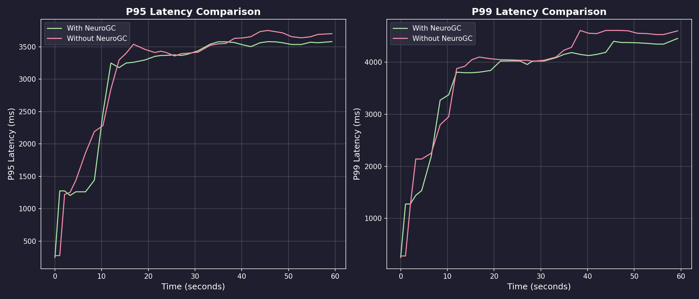
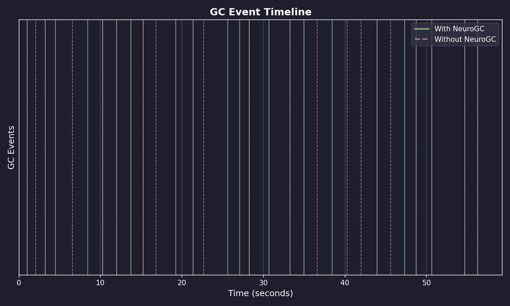
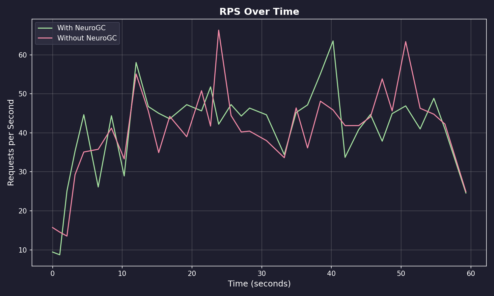

# Benchmark Results

**Date:** February 09, 2026 at 09:50

**Raw Data:** [benchmark.csv](./benchmark.csv)

- Training Load : `locust -f locustfile.py --headless ...`
- Evaluation Load : `locust -f locustfile.py --headless ...`

## Performance Summary

| Metric | Without NeuroGC | With NeuroGC | Improvement |
| ------ | --------------- | ------------ | ----------- |
| Avg CPU (%) | 34.3 | 32.6 | 🟢 +5.0% |
| Avg Memory (%) | 54.6 | 54.6 | 🟢 +0.1% |
| Avg Disk Read | 23345.75 | 16588.36 | 🟢 +28.9% |
| Avg Disk Write | 7753257.95 | 7022988.96 | 🟢 +9.4% |
| Avg Net Sent | 110566.35 | 129003.40 | 🔴 -16.7% |
| Avg Net Recv | 154011.56 | 142645.32 | 🟢 +7.4% |
| P95 Latency (ms) | 3028.4 | 2962.2 | 🟢 +2.2% |
| P99 Latency (ms) | 3713.1 | 3597.0 | 🟢 +3.1% |
| Avg RPS | 40.5 | 41.0 | 🟢 +1.2% |
| GC Events | 22 | 23 | 🟢 +4.5% |


## Visualizations

### Memory Usage Comparison


### Latency Comparison



### GC Event Timeline



### RPS Over Time



## ML Model Metadata

```json
{
  "name": "lstm",
  "input_size": 10,
  "hidden_size": 64,
  "num_layers": 10,
  "sequence_length": 100,
  "epochs": 100,
  "learning_rate": 0.001,
  "batch_size": 32
}
```

## System Information

| Property | Value |
| -------- | ----- |
| Operating System | macOS 14.6 |
| Architecture | arm64 |
| CPU | arm |
| CPU Cores | 8 (logical: 8) |
| Memory | 24.0 GB |
| Disk | 460.4 GB |
| Python Version | 3.14.0 |

## Benchmark Details

| Property | Value |
| -------- | ----- |
| Total Samples (with GC) | 35 |
| Total Samples (without GC) | 35 |
| Duration | ~35 seconds |
