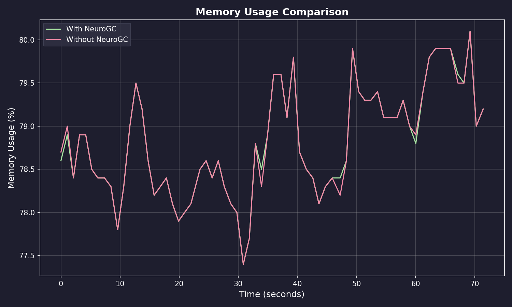
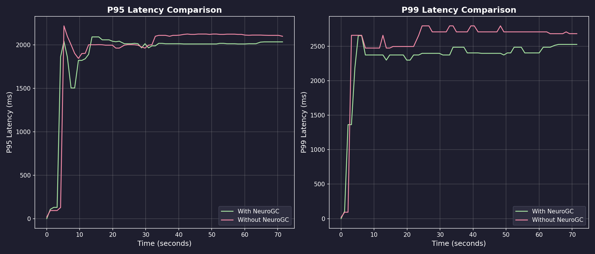
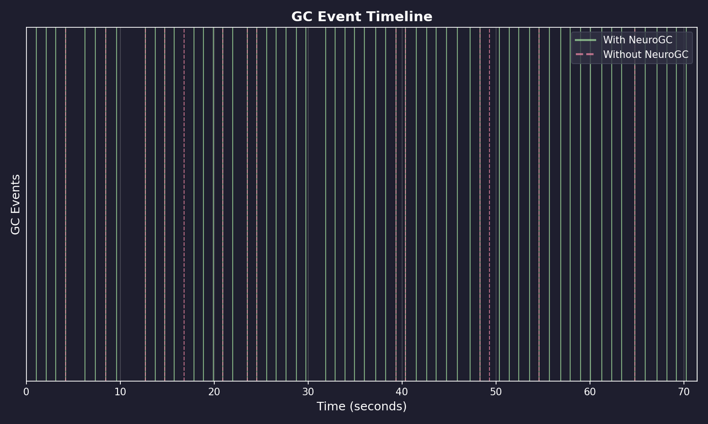
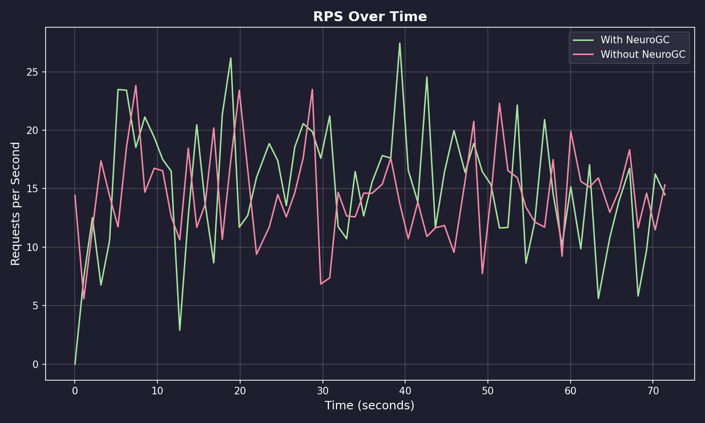

# Benchmark Results

**Date:** January 30, 2026 at 23:04

**Raw Data:** [benchmark.csv](./benchmark.csv)

## Performance Summary

| Metric | Without NeuroGC | With NeuroGC | Improvement |
| ------ | --------------- | ------------ | ----------- |
| Avg Memory (%) | 78.8 | 78.8 | -0.0% |
| P95 Latency (ms) | 1914.9 | 1875.5 | +2.1% |
| P99 Latency (ms) | 2546.3 | 2317.6 | +9.0% |
| GC Events | 14 | 60 | +328.6% |
| Avg RPS | 14.4 | 15.2 | +5.4% |

## Visualizations

### Memory Usage Comparison

### Latency Comparison

### GC Event Timeline

### RPS Over Time

## ML Model Metadata

| Property | Value |
| -------- | ----- |
| Model Name | lstm |
| Version | unknown |
| Description | LSTM-based GC predictor for temporal pattern recognition |
| Input Features | cpu, mem, disk_read, disk_write, net_sent, net_recv |
| Sequence Length | 1 |

## System Information

| Property | Value |
| -------- | ----- |
| Operating System | macOS 15.7.3 |
| Architecture | arm64 |
| CPU | arm |
| CPU Cores | 8 (logical: 8) |
| Memory | 16.0 GB |
| Disk | 460.4 GB |
| Python Version | 3.14.2 |

## Benchmark Details

| Property | Value |
| -------- | ----- |
| Total Samples (with GC) | 67 |
| Total Samples (without GC) | 67 |
| Duration | ~67 seconds |
