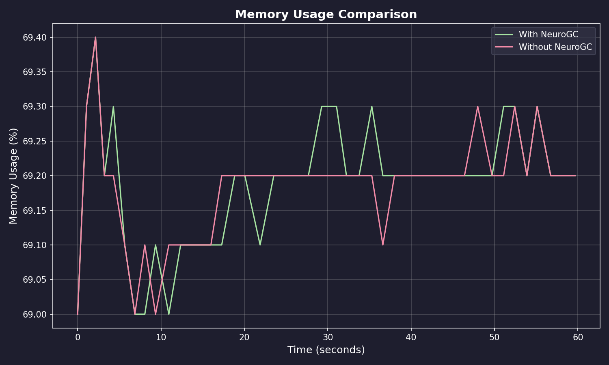
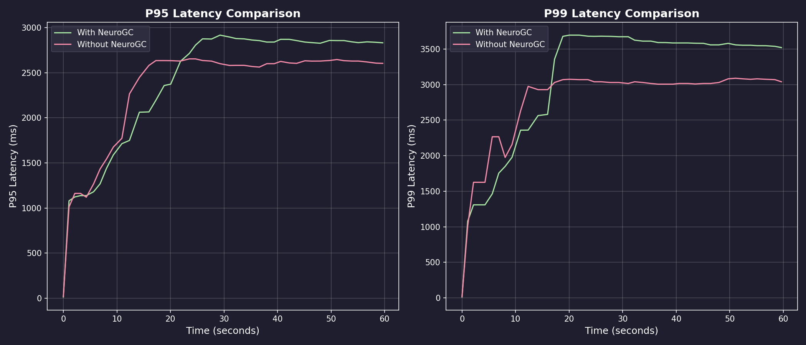
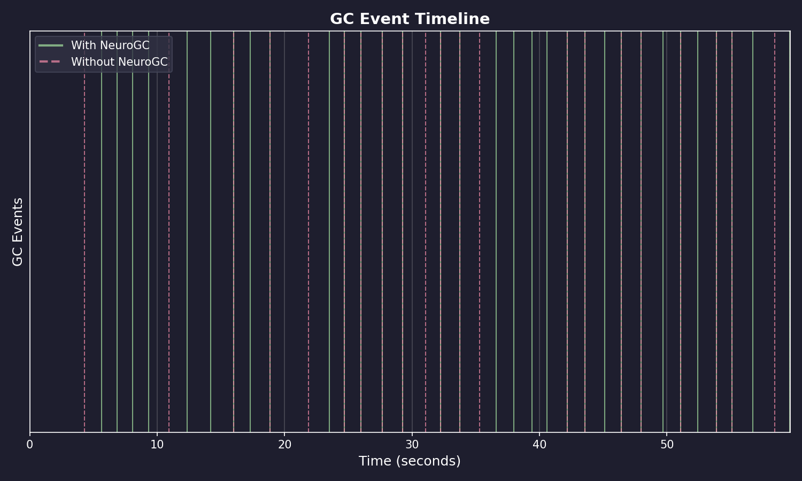
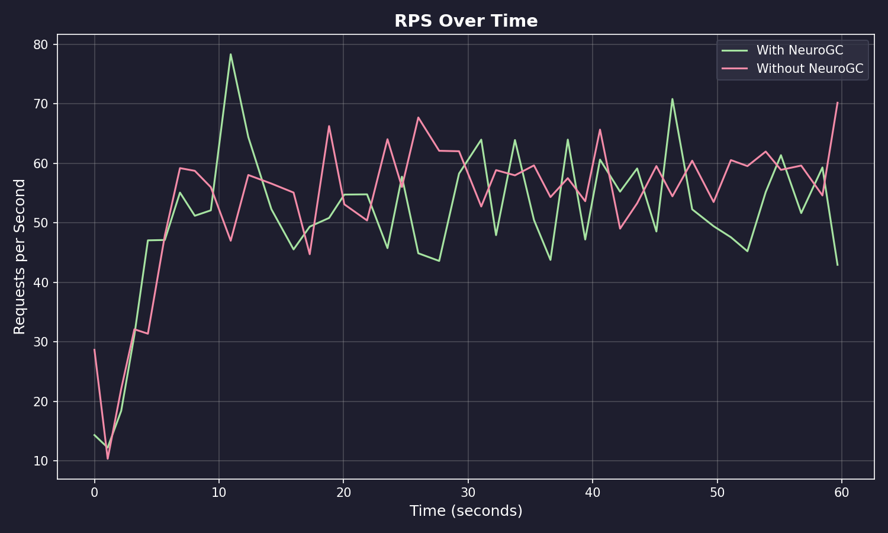

# Benchmark Results

**Date:** January 30, 2026 at 23:27

**Raw Data:** [benchmark.csv](./benchmark.csv)

## Performance Summary

| Metric | Without NeuroGC | With NeuroGC | Improvement |
| ------ | --------------- | ------------ | ----------- |
| Avg Memory (%) | 69.2 | 69.2 | -0.0% |
| P95 Latency (ms) | 2278.7 | 2353.8 | -3.3% |
| P99 Latency (ms) | 2727.1 | 3019.7 | -10.7% |
| GC Events | 22 | 32 | +45.5% |
| Avg RPS | 53.6 | 50.5 | -5.9% |

## Visualizations

### Memory Usage Comparison

### Latency Comparison

### GC Event Timeline

### RPS Over Time

## ML Model Metadata

| Property | Value |
| -------- | ----- |
| Model Name | lstm |
| Version | unknown |
| Description | LSTM-based GC predictor for temporal pattern recognition |
| Input Features | cpu, mem, disk_read, disk_write, net_sent, net_recv |
| Sequence Length | 1 |

## System Information

| Property | Value |
| -------- | ----- |
| Operating System | macOS 15.7.3 |
| Architecture | arm64 |
| CPU | arm |
| CPU Cores | 8 (logical: 8) |
| Memory | 16.0 GB |
| Disk | 460.4 GB |
| Python Version | 3.14.2 |

## Benchmark Details

| Property | Value |
| -------- | ----- |
| Total Samples (with GC) | 43 |
| Total Samples (without GC) | 43 |
| Duration | ~43 seconds |
