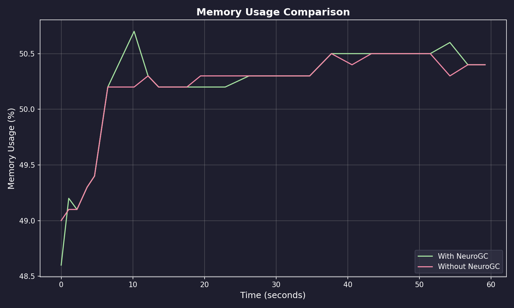
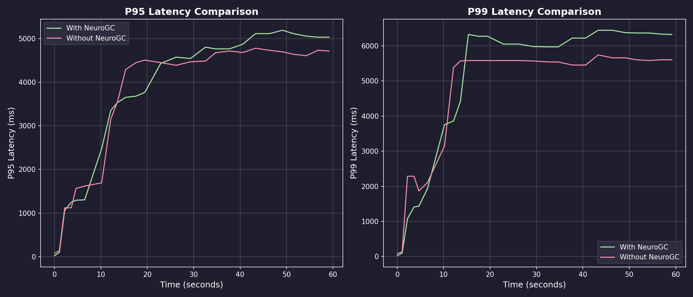
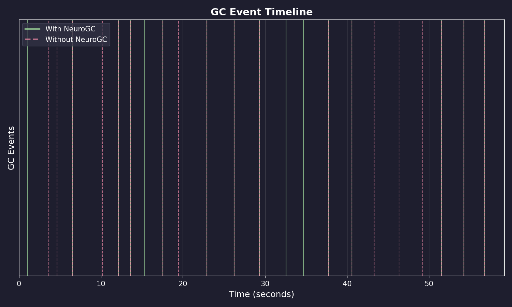
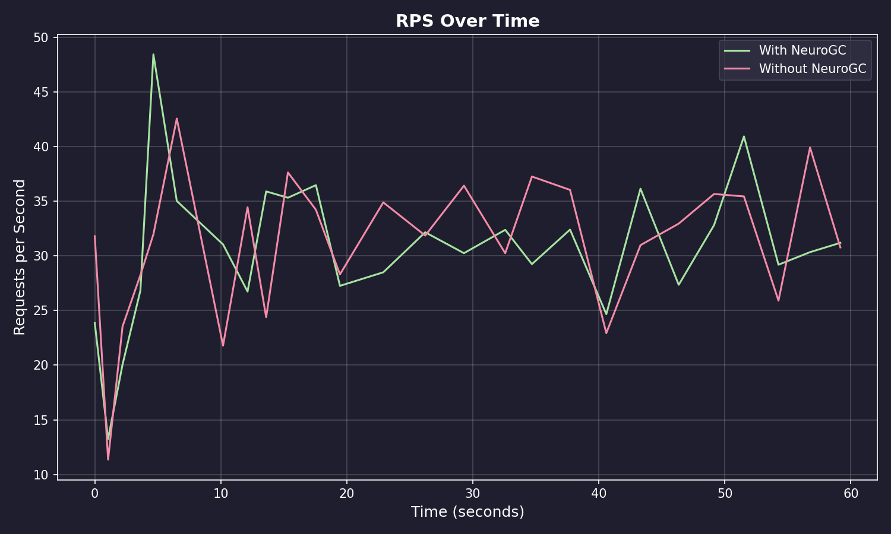

# Benchmark Results

**Date:** January 31, 2026 at 20:06

**Raw Data:** [benchmark.csv](./benchmark.csv)

- Training Load : `locust -f locustfile.py --headless -u 100 -r 10 --run-time 1m`
- Evaluation Load : `locust -f locustfile.py --headless -u 100 -r 10 --run-time 1m`

## Performance Summary

| Metric           | Without NeuroGC | With NeuroGC | Improvement |
| ---------------- | --------------- | ------------ | ----------- |
| Avg CPU (%)      | 38.0            | 29.0         | 🟢 +23.7%   |
| Avg Memory (%)   | 50.1            | 50.1         | 0.0%        |
| Avg Disk Read    | 14410.73        | 20069.47     | 🔴 -39.3%   |
| Avg Disk Write   | 9903865.30      | 6187022.12   | 🟢 +37.5%   |
| Avg Net Sent     | 81743.25        | 87163.18     | 🔴 -6.6%    |
| Avg Net Recv     | 102192.21       | 99026.00     | 🟢 +3.1%    |
| P95 Latency (ms) | 3538.8          | 3609.9       | 🔴 -2.0%    |
| P99 Latency (ms) | 4530.3          | 4769.2       | 🔴 -5.3%    |
| Avg RPS          | 31.2            | 30.7         | 🔴 -1.7%    |
| GC Events        | 19              | 17           | 🔴 -10.5%   |

## Visualizations

### Memory Usage Comparison

### Latency Comparison

### GC Event Timeline

### RPS Over Time

## ML Model Metadata

| Property        | Value                                                    |
| --------------- | -------------------------------------------------------- |
| Model Name      | lstm                                                     |
| Version         | unknown                                                  |
| Description     | LSTM-based GC predictor for temporal pattern recognition |
| Input Features  | cpu, mem, disk_read, disk_write, net_sent, net_recv      |
| Sequence Length | 1                                                        |

## System Information

| Property         | Value          |
| ---------------- | -------------- |
| Operating System | macOS 14.6     |
| Architecture     | arm64          |
| CPU              | arm            |
| CPU Cores        | 8 (logical: 8) |
| Memory           | 24.0 GB        |
| Disk             | 460.4 GB       |
| Python Version   | 3.14.0         |

## Benchmark Details

| Property                   | Value       |
| -------------------------- | ----------- |
| Total Samples (with GC)    | 26          |
| Total Samples (without GC) | 26          |
| Duration                   | ~26 seconds |
