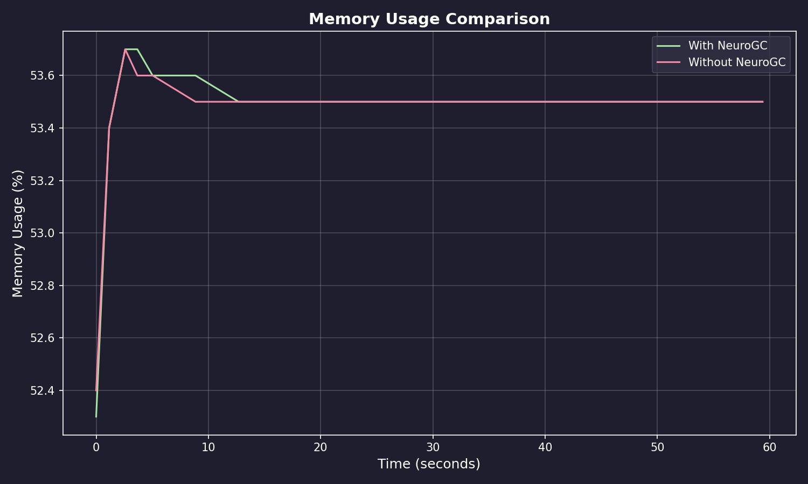
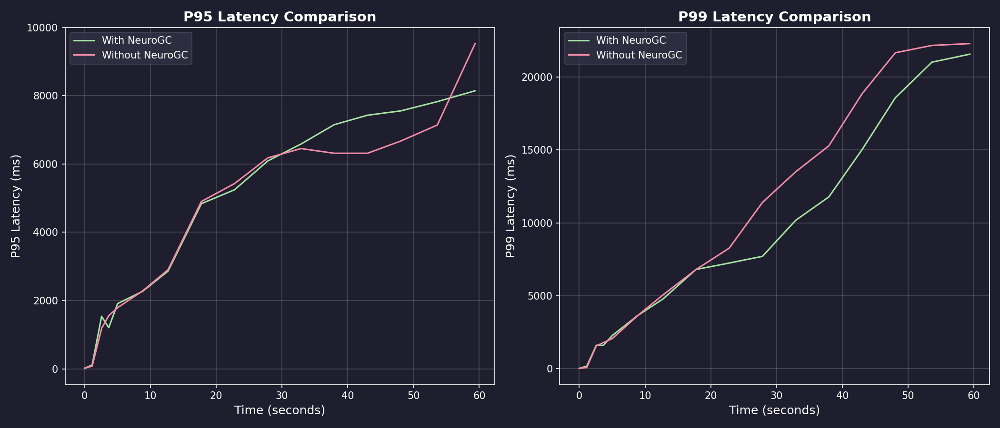
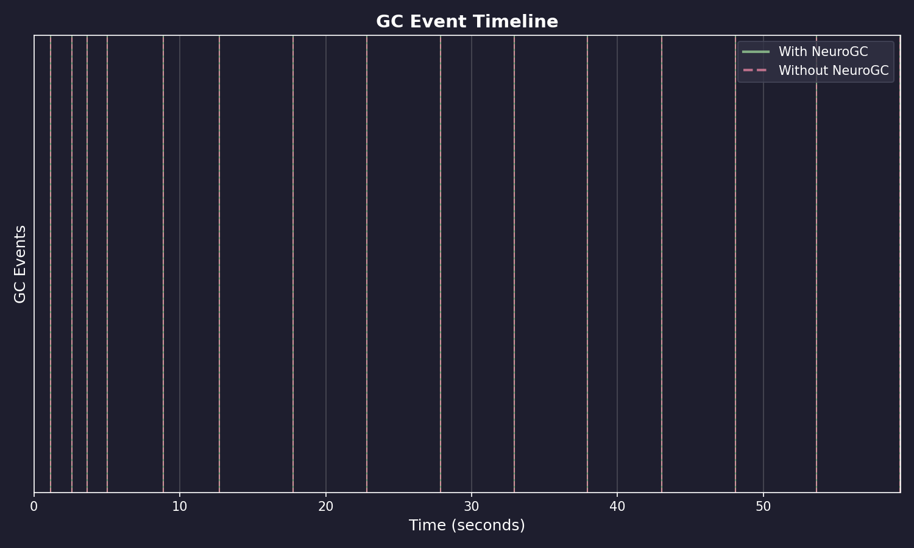
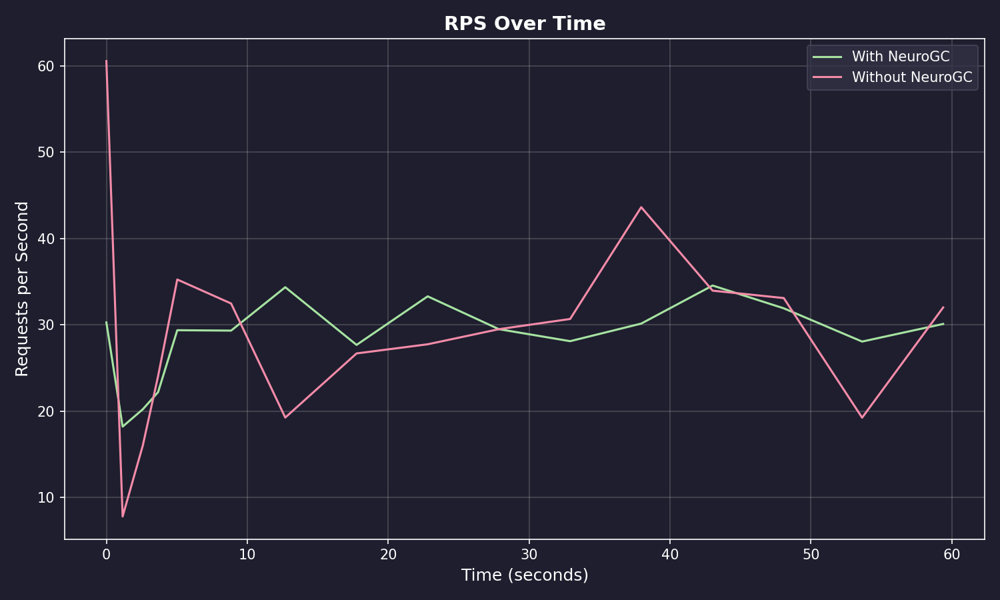

# Benchmark Results

**Date:** January 31, 2026 at 20:15

**Raw Data:** [benchmark.csv](./benchmark.csv)

- Training Load : `locust -f locustfile.py --headless -u 500 -r 10 --run-time 1m`
- Evaluation Load : `locust -f locustfile.py --headless -u 500 -r 10 --run-time 1m`

## Performance Summary

| Metric           | Without NeuroGC | With NeuroGC | Improvement |
| ---------------- | --------------- | ------------ | ----------- |
| Avg CPU (%)      | 40.2            | 43.2         | 🔴 -7.4%    |
| Avg Memory (%)   | 53.5            | 53.5         | 0.0%        |
| Avg Disk Read    | 10371.80        | 4011.52      | 🟢 +61.3%   |
| Avg Disk Write   | 6082227.94      | 5377198.66   | 🟢 +11.6%   |
| Avg Net Sent     | 68960.00        | 62821.57     | 🟢 +8.9%    |
| Avg Net Recv     | 78285.45        | 68550.20     | 🟢 +12.4%   |
| P95 Latency (ms) | 4297.5          | 4424.6       | 🔴 -3.0%    |
| P99 Latency (ms) | 9652.6          | 8373.4       | 🟢 +13.3%   |
| Avg RPS          | 29.5            | 28.6         | 🔴 -3.1%    |
| GC Events        | 15              | 15           | 0.0%        |

## Visualizations

### Memory Usage Comparison



### Latency Comparison



### GC Event Timeline



### RPS Over Time



## ML Model Metadata

```json
{
  "name": "lstm",
  "input_size": 10,
  "hidden_size": 64,
  "num_layers": 2,
  "sequence_length": 10,
  "epochs": 100,
  "learning_rate": 0.001,
  "batch_size": 32
}
```

## System Information

| Property         | Value          |
| ---------------- | -------------- |
| Operating System | macOS 14.6     |
| Architecture     | arm64          |
| CPU              | arm            |
| CPU Cores        | 8 (logical: 8) |
| Memory           | 24.0 GB        |
| Disk             | 460.4 GB       |
| Python Version   | 3.14.0         |

## Benchmark Details

| Property                   | Value       |
| -------------------------- | ----------- |
| Total Samples (with GC)    | 16          |
| Total Samples (without GC) | 16          |
| Duration                   | ~16 seconds |
