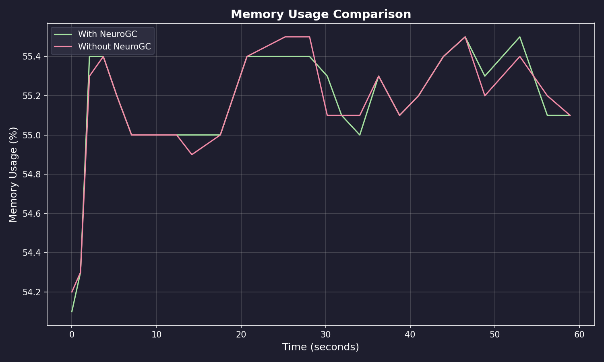
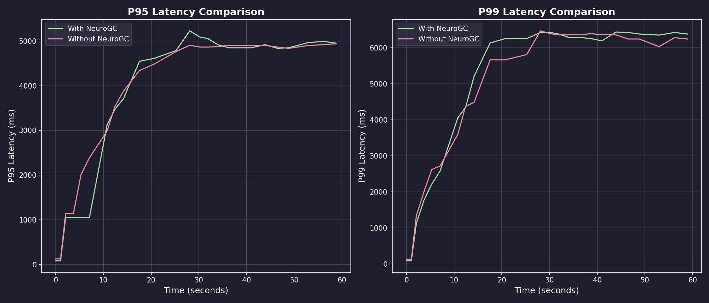
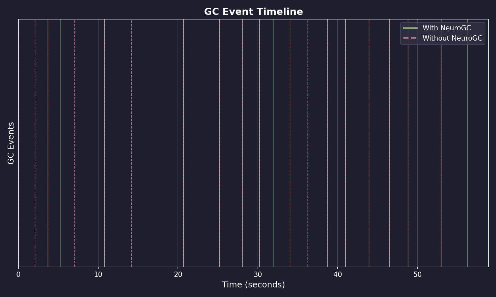
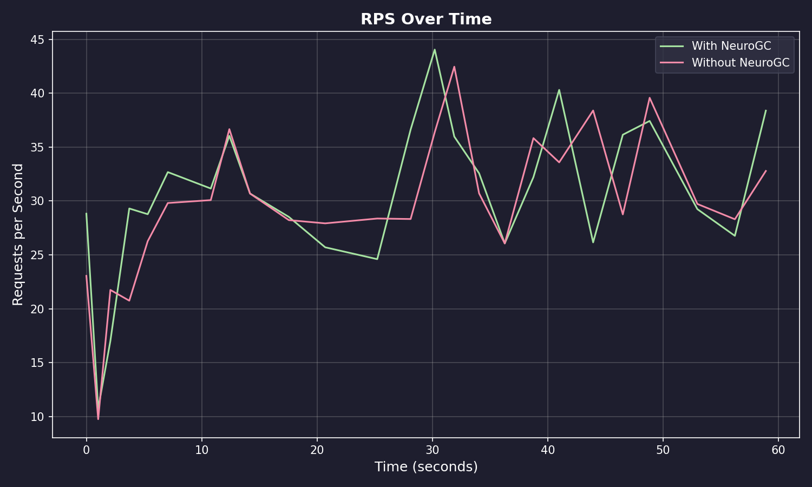

# Benchmark Results

**Date:** February 09, 2026 at 09:12

**Raw Data:** [benchmark.csv](./benchmark.csv)

- Training Load : `locust -f locustfile.py --headless ...`
- Evaluation Load : `locust -f locustfile.py --headless ...`

## Performance Summary

| Metric | Without NeuroGC | With NeuroGC | Improvement |
| ------ | --------------- | ------------ | ----------- |
| Avg CPU (%) | 37.5 | 33.7 | 🟢 +10.2% |
| Avg Memory (%) | 55.1 | 55.1 | 0.0% |
| Avg Disk Read | 2433.94 | 1638.77 | 🟢 +32.7% |
| Avg Disk Write | 6325593.39 | 5631381.21 | 🟢 +11.0% |
| Avg Net Sent | 116008.92 | 68573.32 | 🟢 +40.9% |
| Avg Net Recv | 98824.23 | 92021.42 | 🟢 +6.9% |
| P95 Latency (ms) | 3780.6 | 3718.8 | 🟢 +1.6% |
| P99 Latency (ms) | 4827.9 | 4913.1 | 🔴 -1.8% |
| Avg RPS | 29.8 | 30.6 | 🟢 +2.9% |
| GC Events | 18 | 17 | 🔴 -5.6% |


## Visualizations

### Memory Usage Comparison



### Latency Comparison



### GC Event Timeline



### RPS Over Time



## ML Model Metadata

```json
{
  "name": "transformer",
  "d_model": 64,
  "nhead": 4,
  "num_layers": 2,
  "sequence_length": 10,
  "epochs": 100,
  "learning_rate": 0.001,
  "batch_size": 32
}
```

## System Information

| Property | Value |
| -------- | ----- |
| Operating System | macOS 14.6 |
| Architecture | arm64 |
| CPU | arm |
| CPU Cores | 8 (logical: 8) |
| Memory | 24.0 GB |
| Disk | 460.4 GB |
| Python Version | 3.14.0 |

## Benchmark Details

| Property | Value |
| -------- | ----- |
| Total Samples (with GC) | 25 |
| Total Samples (without GC) | 25 |
| Duration | ~25 seconds |
