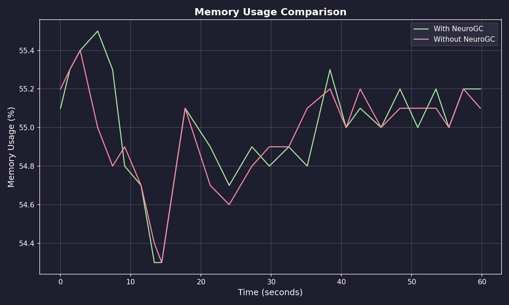
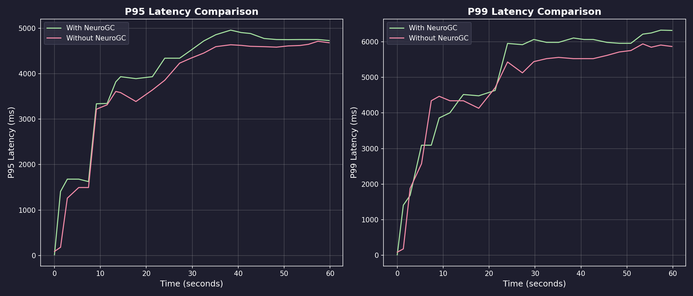
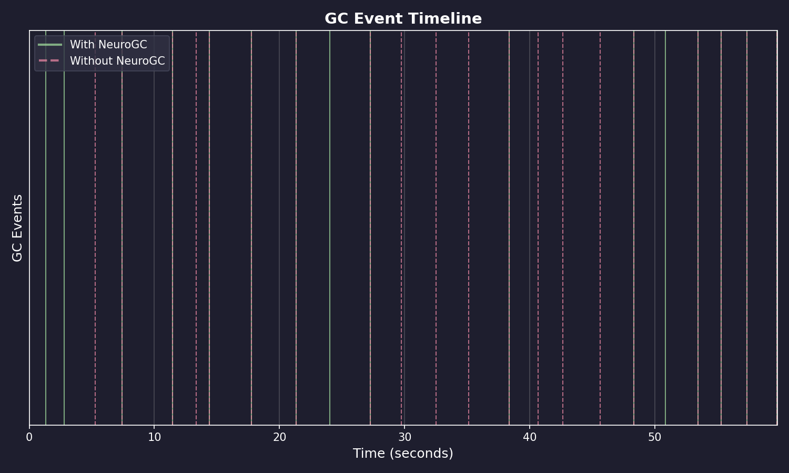
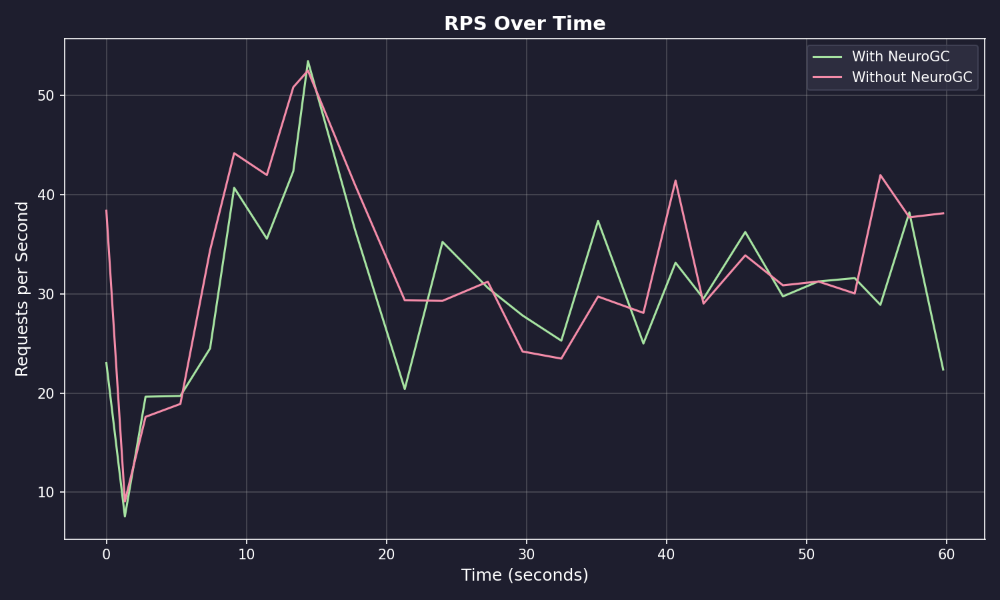

# Benchmark Results

**Date:** February 09, 2026 at 09:33

**Raw Data:** [benchmark.csv](./benchmark.csv)

- Training Load : `locust -f locustfile.py --headless ...`
- Evaluation Load : `locust -f locustfile.py --headless ...`

## Performance Summary

| Metric           | Without NeuroGC | With NeuroGC | Improvement |
| ---------------- | --------------- | ------------ | ----------- |
| Avg CPU (%)      | 39.3            | 38.4         | 🟢 +2.2%    |
| Avg Memory (%)   | 55.0            | 55.0         | 🔴 -0.1%    |
| Avg Disk Read    | 6150.33         | 7740.47      | 🔴 -25.9%   |
| Avg Disk Write   | 5745533.81      | 6575194.41   | 🔴 -14.4%   |
| Avg Net Sent     | 75869.39        | 102453.01    | 🔴 -35.0%   |
| Avg Net Recv     | 91002.29        | 102489.63    | 🔴 -12.6%   |
| P95 Latency (ms) | 3579.4          | 3825.1       | 🔴 -6.9%    |
| P99 Latency (ms) | 4604.0          | 4856.3       | 🔴 -5.5%    |
| Avg RPS          | 33.0            | 30.2         | 🔴 -8.5%    |
| GC Events        | 20              | 16           | 🔴 -20.0%   |

## Visualizations

### Memory Usage Comparison



### Latency Comparison



### GC Event Timeline



### RPS Over Time



## ML Model Metadata

```json
{
  "name": "transformer",
  "d_model": 64,
  "nhead": 4,
  "num_layers": 2,
  "sequence_length": 10,
  "epochs": 100,
  "learning_rate": 0.001,
  "batch_size": 32
}
```

## System Information

| Property         | Value          |
| ---------------- | -------------- |
| Operating System | macOS 14.6     |
| Architecture     | arm64          |
| CPU              | arm            |
| CPU Cores        | 8 (logical: 8) |
| Memory           | 24.0 GB        |
| Disk             | 460.4 GB       |
| Python Version   | 3.14.0         |

## Benchmark Details

| Property                   | Value       |
| -------------------------- | ----------- |
| Total Samples (with GC)    | 26          |
| Total Samples (without GC) | 26          |
| Duration                   | ~26 seconds |
