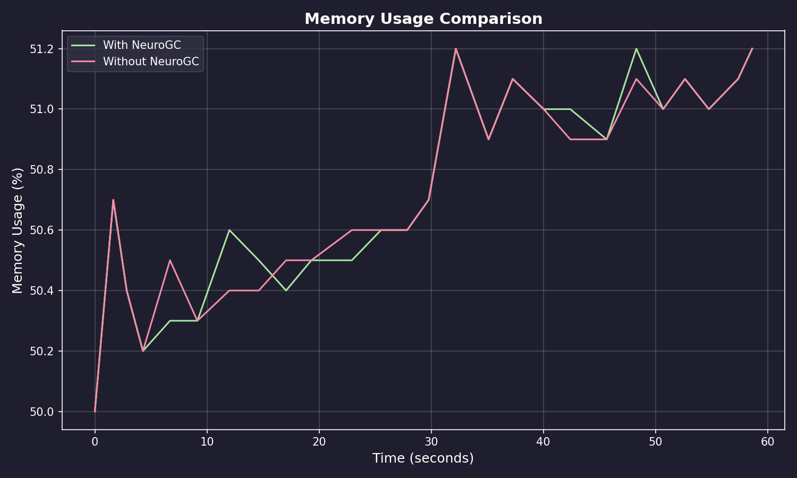
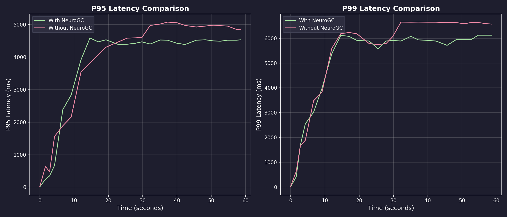
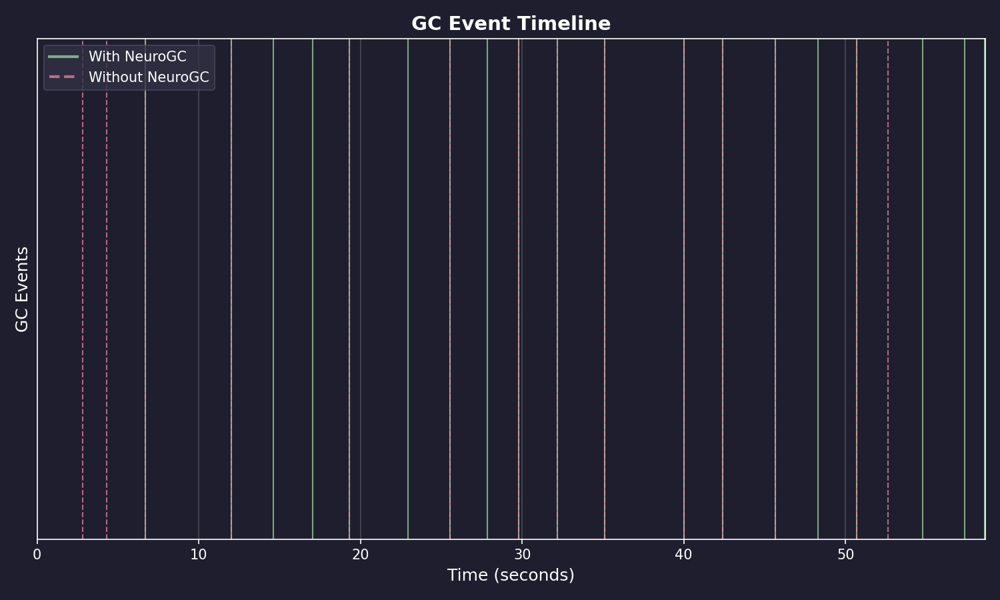
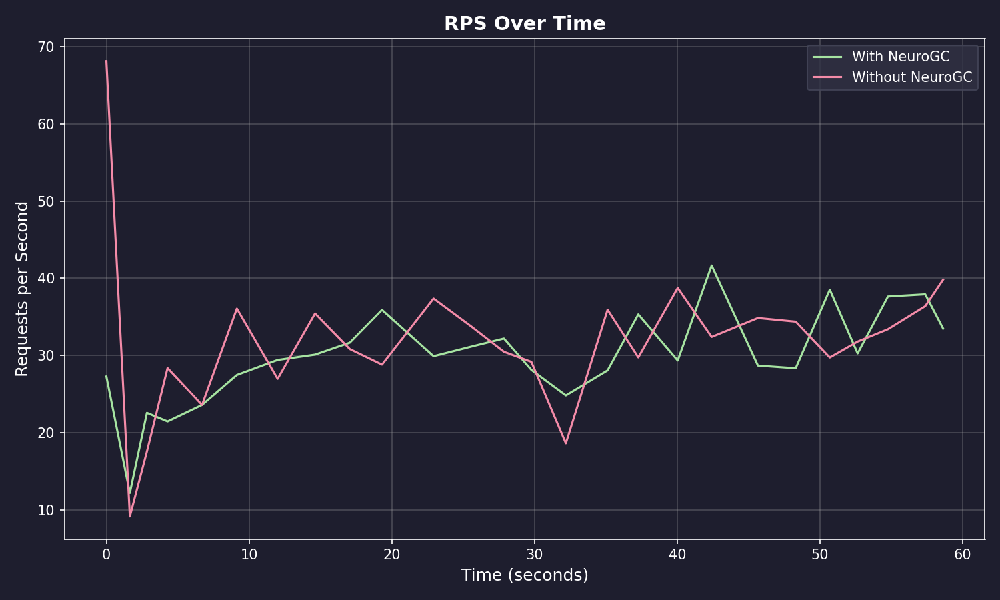

# Benchmark Results

**Date:** February 09, 2026 at 08:30

**Raw Data:** [benchmark.csv](./benchmark.csv)

- Training Load : `locust -f locustfile.py --headless -u 100 -r 10 --run-time 1m`
- Evaluation Load : `locust -f locustfile.py --headless -u 100 -r 10 --run-time 1m`

## Performance Summary

| Metric           | Without NeuroGC | With NeuroGC | Improvement |
| ---------------- | --------------- | ------------ | ----------- |
| Avg CPU (%)      | 38.6            | 39.7         | 🔴 -3.0%    |
| Avg Memory (%)   | 50.7            | 50.7         | 0.0%        |
| Avg Disk Read    | 3238.48         | 109998.77    | 🔴 -3296.6% |
| Avg Disk Write   | 5607862.60      | 5505804.92   | 🟢 +1.8%    |
| Avg Net Sent     | 85613.81        | 75979.05     | 🟢 +11.3%   |
| Avg Net Recv     | 104797.67       | 79235.26     | 🟢 +24.4%   |
| P95 Latency (ms) | 3858.2          | 3676.0       | 🟢 +4.7%    |
| P99 Latency (ms) | 5331.0          | 5000.8       | 🟢 +6.2%    |
| Avg RPS          | 32.0            | 29.9         | 🔴 -6.6%    |
| GC Events        | 14              | 19           | 🟢 +35.7%   |

## Visualizations

### Memory Usage Comparison



### Latency Comparison



### GC Event Timeline



### RPS Over Time



## ML Model Metadata

```json
{
  "name" : "transformer"
  "d_model": 64,
  "nhead": 4,
  "num_layers": 2,
  "sequence_length": 10,
  "epochs": 100,
  "learning_rate": 0.001,
  "batch_size": 32
},
```

## System Information

| Property         | Value          |
| ---------------- | -------------- |
| Operating System | macOS 14.6     |
| Architecture     | arm64          |
| CPU              | arm            |
| CPU Cores        | 8 (logical: 8) |
| Memory           | 24.0 GB        |
| Disk             | 460.4 GB       |
| Python Version   | 3.14.0         |

## Benchmark Details

| Property                   | Value       |
| -------------------------- | ----------- |
| Total Samples (with GC)    | 26          |
| Total Samples (without GC) | 26          |
| Duration                   | ~26 seconds |
